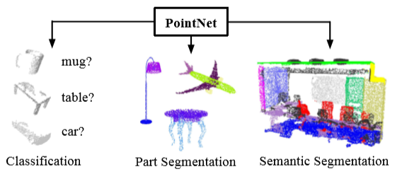

## [PointNet: Deep Learning on Point Sets for 3D Classification and Segmentation](https://arxiv.org/pdf/1612.00593v2.pdf)

- 点云是一种重要的几何数据结构类型。由于其不规则的格式，大多数研究人员将这些数据转换成规则的三维体素网格或图像集合。然而，这将导致不必要的数据量，并引发问题。本文设计了一种新的直接计算点云的神经网络，它很好地考虑了输入点的排列不变性。我们的网络名为PointNet，它为从对象分类、部件分割到场景语义解析的应用程序提供了统一的体系结构。虽然很简单，但是PointNet非常高效。从经验上看，它表现出与现有水平相当甚至更好的强劲表现。从理论上讲，我们提供了分析来理解网络已经学到了什么，以及为什么网络在输入扰动和破坏方面是健壮的。

### 要点记录
#### What
1. 点云具有非欧几里得结构，转换为常规3D体素网格或图像集合耗费资源并引起问题。
2. 
#### How
1. PointNet直接利用点云数据进行计算。
#### Why
1. 常规3D体素网格或图像集合（例如视图），数据表示变换使得得到的数据不必要地大量增加同时还引入了可能模糊数据自然不变性的量化伪像（quantization artifacts）。点云是简单而统一的结构，可以避免网格的组合不规则性和复杂性，因此更容易学习。
#### Result
#### Drawbacks

### 参考

### 提问
