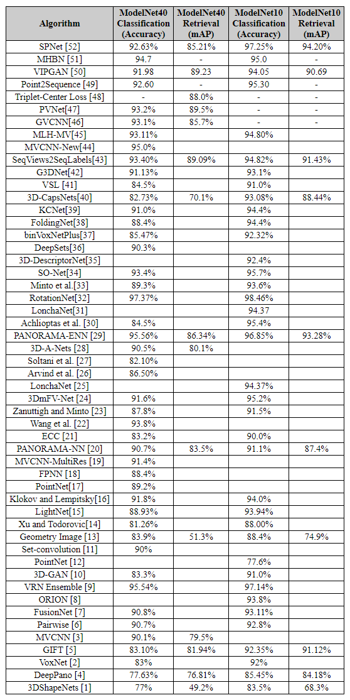
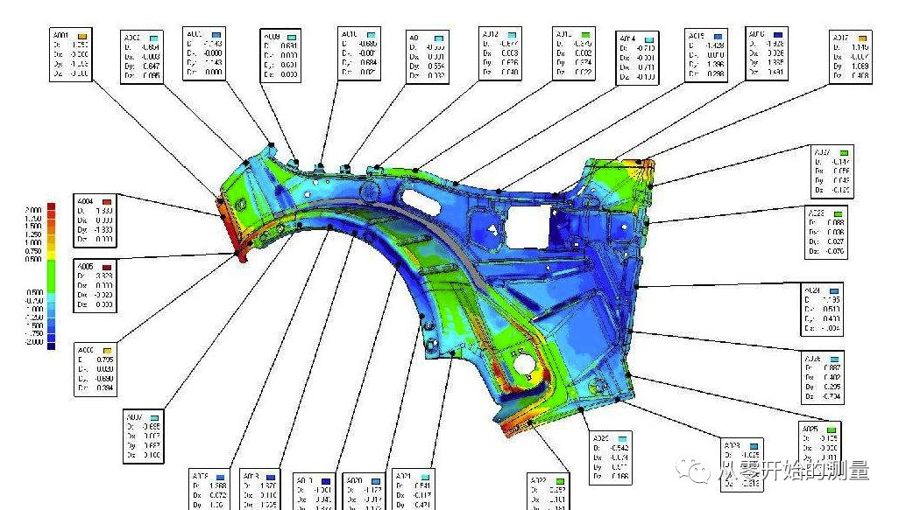
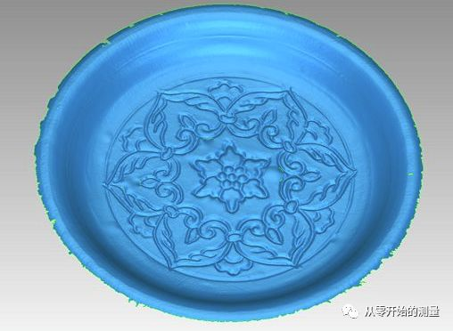

# Point-Cloud-Papers
## 背景
- 三维深度学习子任务简介

  - 多视角（multi-view）：通过多视角二维图片组合为三维物体，此方法将传统CNN应用于多张二维视角的图片，特征被view pooling procedure聚合起来形成三维物体；
  - 体素（volumetric）：通过将物体表现为空间中的体素进行类似于二维的三维卷积（例如，卷积核大小为5x5x5），是规律化的并且易于类比二维的，但同时因为多了一个维度出来，时间和空间复杂度都非常高，目前已经不是主流的方法了；
  - 点云（point clouds）：直接将三维点云抛入网络进行训练，数据量小。主要任务有分类、分割以及大场景下语义分割；
  - 非欧式（manifold，graph）：在流形或图的结构上进行卷积，三维点云可以表现为mesh结构，可以通过点对之间临接关系表现为图的结构。
## 友情链接
- [awesome-point-cloud-analysis](https://github.com/Yochengliu/awesome-point-cloud-analysis)
  - 多个点云数据集整理
  - 近3年文献整理归类
- [3D Machine Learning](https://github.com/timzhang642/3D-Machine-Learning)
  - 完整数据集收集与介绍
  - 多个 Tasks 优秀模型介绍

## 数据集
- [ModelNet](http://modelnet.cs.princeton.edu/) The Princeton ModelNet . [分类]

  ModelNet总共有662中目标分类，127915个CAD，以及十类标记过方向朝向的数据。
  其中包含了三个子集：
  - ModelNet10：十个标记朝向的子集数据；
  - ModelNet40：40个类别的三维模型；
  - Aligned40：40类标记的三维模型。
- [ShapeNet](https://www.shapenet.org/) A collaborative dataset between researchers at Princeton, Stanford and TTIC. [语义分割]
  - ShapeNet 是一个丰富标注的大规模点云数据集，其中包含了55中常见的物品类别和513000个三维模型。
  - [ShapeNetSem](https://shapenet.org/)：ShapeNet 缩减版，包含了270类的12000个物体。
- [更多数据集中文介绍](https://blog.csdn.net/u014636245/article/details/83269939)

## 排行榜
[ModelNet Benchmark Leaderboard](http://modelnet.cs.princeton.edu/)

## 应用方向
- 机械制造，逆向工程，机械检测

- 无人驾驶

- 三维重建、文物修复

## 论文

# 其他
- [图网络一般适用的数据集整理](https://www.jianshu.com/p/67137451b67f)
