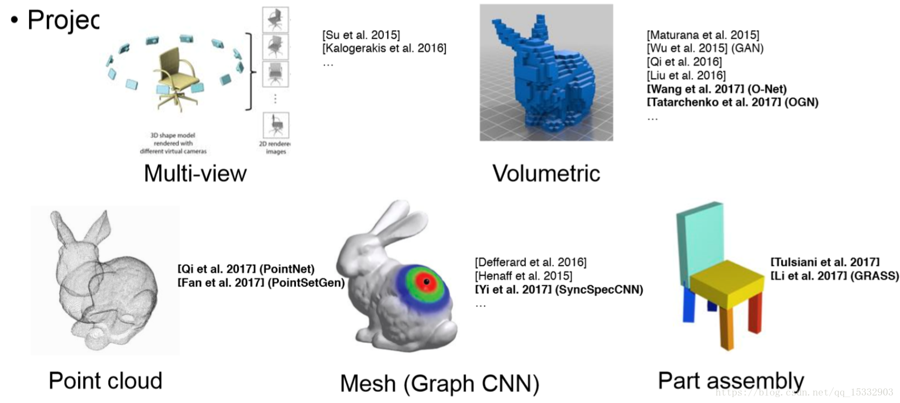
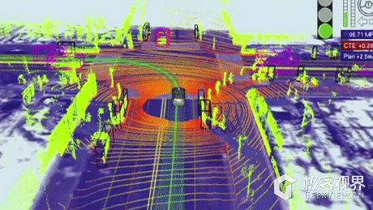

# 🛫 Point-Cloud
## 背景
- 三维深度学习子任务简介

  - 多视角（multi-view）：通过多视角二维图片组合为三维物体，此方法将传统CNN应用于多张二维视角的图片，特征被view pooling procedure聚合起来形成三维物体；
  - 体素（volumetric）：通过将物体表现为空间中的体素进行类似于二维的三维卷积（例如，卷积核大小为5x5x5），是规律化的并且易于类比二维的，但同时因为多了一个维度出来，时间和空间复杂度都非常高，目前已经不是主流的方法了；
  - 点云（point clouds）：直接将三维点云抛入网络进行训练，数据量小。主要任务有分类、分割以及大场景下语义分割；
  - 非欧式（manifold，graph）：在流形或图的结构上进行卷积，三维点云可以表现为mesh结构，可以通过点对之间临接关系表现为图的结构。
## 相关链接
- [awesome-point-cloud-analysis](https://github.com/Yochengliu/awesome-point-cloud-analysis)
  - 多个点云数据集整理
  - 近3年文献整理归类
- [3D Machine Learning](https://github.com/timzhang642/3D-Machine-Learning)
  - 完整数据集收集与介绍
  - 多个 Tasks 优秀模型介绍

## 数据集
- [ModelNet](http://modelnet.cs.princeton.edu/) The Princeton ModelNet . [分类]

  ModelNet总共有662中目标分类，127915个CAD，以及十类标记过方向朝向的数据。
  其中包含了三个子集：
  - ModelNet10：十个标记朝向的子集数据；
  - ModelNet40：40个类别的三维模型；
  - Aligned40：40类标记的三维模型。
- [ShapeNet](https://www.shapenet.org/) A collaborative dataset between researchers at Princeton, Stanford and TTIC. [语义分割]
  - ShapeNet 是一个丰富标注的大规模点云数据集，其中包含了55中常见的物品类别和513000个三维模型。
  - [ShapeNetSem](https://shapenet.org/)：ShapeNet 缩减版，包含了270类的12000个物体。
- [更多数据集中文介绍](https://blog.csdn.net/u014636245/article/details/83269939)

## 排行榜
[ModelNet Benchmark Leaderboard](http://modelnet.cs.princeton.edu/)

## 应用方向
- 机械制造，逆向工程，机械检测
- 无人驾驶

- 三维重建、文物修复
- [……](https://mp.weixin.qq.com/s?__biz=MzU4OTg2NjUxOQ==&mid=2247483743&idx=1&sn=a350f8c3ebff44748624007a920ec047&chksm=fdc7b227cab03b31b9fe0113798a5f88d1c583a26fe6ff7367f22d3cb6c0d9e0c17d5cca21a8&scene=7&key=a22ef280647b088d119afe171b90066c3ea44b8f2d219c75213943eac3f896a8ba9764d7d30e0d249f229518eacc4b5b653863d28b65d6cb7dafe9492ca48d61b08fbcee40c9fa8310a7a4f5947d328c&ascene=0&uin=NTg0MjEwMDE4&devicetype=Windows+10&version=62060739&lang=zh_CN&pass_ticket=Ok3g2hCAhpj0r%2BZS8P8uCJsEVH7xb84PflcJ2P8Des8EJUdPMVdBPTRZCS2QvKo1)

# Graph & Point Cloud & segmentation
## 2017
### 全局信息
- 🐍 [[CVPR](http://openaccess.thecvf.com/content_cvpr_2017/papers/Qi_PointNet_Deep_Learning_CVPR_2017_paper.pdf)] PointNet: Deep Learning on Point Sets for 3D Classification and Segmentation. [[tensorflow](https://github.com/charlesq34/pointnet)][[pytorch](https://github.com/fxia22/pointnet.pytorch)] [__`cls.`__ __`seg.`__ __`det.`__] :fire: :star:
  - T-Net 对齐
  - MaxPooling 解决无序问题
### 局部信息
- 🐍 [[NeurIPS](https://papers.nips.cc/paper/7095-pointnet-deep-hierarchical-feature-learning-on-point-sets-in-a-metric-space)] PointNet++: Deep Hierarchical Feature Learning on Point Sets in a Metric Space. [[tensorflow](https://github.com/charlesq34/pointnet2)][[pytorch](https://github.com/erikwijmans/Pointnet2_PyTorch)] [__`cls.`__ __`seg.`__] :fire: :star:
  - FPS 解决池化
  - 固定球半径 解决局部分组
- [🐍](notes/DynamicEdge-ConditionedFiltersinConvolutionalNeuralNetworksonGraphs/README.md) [[CVPR](http://openaccess.thecvf.com/content_cvpr_2017/papers/Simonovsky_Dynamic_Edge-Conditioned_Filters_CVPR_2017_paper.pdf)] Dynamic Edge-Conditioned Filters in Convolutional Neural Networks on Graphs. [__`cls.`__] :star:
  - 构建体素 解决池化
  - 固定球半径 解决局部分组
  - 静态相对坐标 生成卷积核
## 2018
### 局部信息
- [🐍](notes/MiningPointCloudLocalStructuresbyKernelCorrelationandGraphPooling/README.md) [[CVPR](http://openaccess.thecvf.com/content_cvpr_2018/papers/Shen_Mining_Point_Cloud_CVPR_2018_paper.pdf)] Mining Point Cloud Local Structures by Kernel Correlation and Graph Pooling. [[code](http://www.merl.com/research/license#KCNet)] [__`cls.`__ __`seg.`__]
  - k临近 解决局部分组
  - 静态相对坐标 + 核相关类比卷积
- [🐍](notes/AGraph-CNNfor3DPointCloudClassification/README.md) [[ICASSP](https://arxiv.org/abs/1812.01711)] A Graph-CNN for 3D Point Cloud Classification. [[tensorflow](https://github.com/maggie0106/Graph-CNN-in-3D-Point-Cloud-Classification)] [__`cls.`__] :fire:
  - FPS 解决池化
  - k临近 解决局部分组
  - 静态相对坐标 + 谱图卷积
- [🐍](notes/DynamicGraphCNNforLearningonPointClouds/README.md) [[arXiv](https://arxiv.org/abs/1801.07829)] Dynamic Graph CNN for Learning on Point Clouds. [[tensorflow](https://github.com/WangYueFt/dgcnn)][[pytorch](https://github.com/muhanzhang/pytorch_DGCNN)] [__`cls.`__ __`seg.`__] :fire: :star:
  - k临近 解决局部分组
  - 动态 坐标 + 相对（坐标 + 特征） 生成卷积核
- [🐍](notes/RGCNN:RegularizedGraphCNNforPointCloudSegmentation/README.md) [[MM](https://arxiv.org/abs/1806.02952)] RGCNN: Regularized Graph CNN for Point Cloud Segmentation. [[tensorflow](https://github.com/tegusi/RGCNN)] [__`seg.`__]
  - KNN全连接
  - 动态相对（坐标 + 特征）+ 谱卷积
  - 正则化
- [🐍](notes/PointConv/README.md) [[CVPR](https://arxiv.org/abs/1811.07246)] PointConv: Deep Convolutional Networks on 3D Point Clouds. [[tensorflow](https://github.com/DylanWusee/pointconv)] [__`cls.`__ __`seg.`__] :fire:
  - K邻近
  - 静态相对坐标
  - 参考蒙特卡罗估计为每个点引入**度**信息
  - 卷积：Sum(MLP(△p) * Cin / MLP(d))
  - 效率卷积：各通道共享卷积核，通过MLP转换到最后的输出
## 2019
- [🐍](notes/GraphAttentionConvolutionforPointCloudSegmentation/README.md) [[CVPR](https://engineering.purdue.edu/~jshan/publications/2018/Lei%20Wang%20Graph%20Attention%20Convolution%20for%20Point%20Cloud%20Segmentation%20CVPR2019.pdf)] Graph Attention Convolution for Point Cloud Segmentation. [__`seg.`__]
  - FPS 解决池化
  - 固定球半径 解决局部分组
  - 静态相对坐标 + 动态相对特征 生成卷积核
- [🐍](notes/3DGraphEmbeddingLearningwithaStructure-awareLossFunctionforPointCloudSemanticInstanceSegmentation/README.md) [[arXiv](https://arxiv.org/abs/1902.05247)] 3D Graph Embedding Learning with a Structure-aware Loss Function for Point Cloud Semantic Instance Segmentation. [__`seg.`__]
  - k临近 解决局部分组
  - MLP(特征拼接) 生成卷积核
# 涉猎
## 2017
- 🥳 [[CVPR](http://openaccess.thecvf.com/content_cvpr_2017/papers/Qi_PointNet_Deep_Learning_CVPR_2017_paper.pdf)] PointNet: Deep Learning on Point Sets for 3D Classification and Segmentation. [[tensorflow](https://github.com/charlesq34/pointnet)][[pytorch](https://github.com/fxia22/pointnet.pytorch)] [__`cls.`__ __`seg.`__ __`det.`__] :fire: :star:
  - 对称函数
  - T-Net
- 💩 谱图 [[CVPR](http://openaccess.thecvf.com/content_cvpr_2017/papers/Yi_SyncSpecCNN_Synchronized_Spectral_CVPR_2017_paper.pdf)] SyncSpecCNN: Synchronized Spectral CNN for 3D Shape Segmentation. [[torch](https://github.com/ericyi/SyncSpecCNN)] [__`seg.`__ __`oth.`__] :star:
- 💩 数据集 [[CVPR](http://openaccess.thecvf.com/content_cvpr_2017/papers/Dai_ScanNet_Richly-Annotated_3D_CVPR_2017_paper.pdf)] ScanNet: Richly-annotated 3D Reconstructions of Indoor Scenes. [[project](http://www.scan-net.org/)][[git](http://www.scan-net.org/)] [__`dat.`__ __`cls.`__ __`rel.`__ __`seg.`__ __`oth.`__] :fire: :star:
- 💩 KD树 [[ICCV](http://openaccess.thecvf.com/content_ICCV_2017/papers/Klokov_Escape_From_Cells_ICCV_2017_paper.pdf)] Escape from Cells: Deep Kd-Networks for the Recognition of 3D Point Cloud Models. [[pytorch](https://github.com/fxia22/kdnet.pytorch)] [__`cls.`__ __`rel.`__ __`seg.`__] :star:
- 💩 巨图 [[ICCV](http://openaccess.thecvf.com/content_ICCV_2017/papers/Liu_3DCNN-DQN-RNN_A_Deep_ICCV_2017_paper.pdf)] 3DCNN-DQN-RNN: A Deep Reinforcement Learning Framework for Semantic Parsing of Large-scale 3D Point Clouds. [[code](https://github.com/CKchaos/scn2pointcloud_tool)] [__`seg.`__]
- 🥳 [[NeurIPS](https://papers.nips.cc/paper/7095-pointnet-deep-hierarchical-feature-learning-on-point-sets-in-a-metric-space)] PointNet++: Deep Hierarchical Feature Learning on Point Sets in a Metric Space. [[tensorflow](https://github.com/charlesq34/pointnet2)][[pytorch](https://github.com/erikwijmans/Pointnet2_PyTorch)] [__`cls.`__ __`seg.`__] :fire: :star:
  - FPS
  - Ball Query
- 💩 自动驾驶 [[ICRA](https://ieeexplore.ieee.org/document/7989591)] Fast segmentation of 3D point clouds: A paradigm on LiDAR data for autonomous vehicle applications. [[code](https://github.com/VincentCheungM/Run_based_segmentation)] [__`seg.`__ __`aut.`__]
- 💩 [[ICRA](https://ieeexplore.ieee.org/document/7989618)] SegMatch: Segment based place recognition in 3D point clouds. [__`seg.`__ __`oth.`__]
## 2018
- 💩 晶格 [[CVPR](http://openaccess.thecvf.com/content_cvpr_2018/papers/Su_SPLATNet_Sparse_Lattice_CVPR_2018_paper.pdf)] SPLATNet: Sparse Lattice Networks for Point Cloud Processing. [[caffe](https://github.com/NVlabs/splatnet)] [__`seg.`__] :fire:
- [🥳](notes/ShapeContextNet/README.md) [[CVPR](http://openaccess.thecvf.com/content_cvpr_2018/papers/Xie_Attentional_ShapeContextNet_for_CVPR_2018_paper.pdf)] Attentional ShapeContextNet for Point Cloud Recognition. [__`cls.`__ __`seg.`__]
  - 形状上下文：固定半径球内分区聚合然后使用全局卷积
  - 自我注意力
- 🥳 [[CVPR](http://openaccess.thecvf.com/content_cvpr_2018/papers/Shen_Mining_Point_Cloud_CVPR_2018_paper.pdf)] Mining Point Cloud Local Structures by Kernel Correlation and Graph Pooling. [[code](http://www.merl.com/research/license#KCNet)] [__`cls.`__ __`seg.`__]
  - KNNG
  - 核相关
- 🥳 [[CVPR](http://openaccess.thecvf.com/content_cvpr_2018/papers/Hua_Pointwise_Convolutional_Neural_CVPR_2018_paper.pdf)] Pointwise Convolutional Neural Networks. [[tensorflow](https://github.com/scenenn/pointwise)] [__`cls.`__ __`seg.`__]
  - 直接按xyz构建有序点云
  - 逐点划`3*3`立方体，单位内点求均值，然后正常卷积
- [[CVPR](http://openaccess.thecvf.com/content_cvpr_2018/papers/Li_SO-Net_Self-Organizing_Network_CVPR_2018_paper.pdf)] SO-Net: Self-Organizing Network for Point Cloud Analysis. [[pytorch](https://github.com/lijx10/SO-Net)] [__`cls.`__ __`seg.`__] :fire: :star:
- [[CVPR](http://openaccess.thecvf.com/content_cvpr_2018/papers/Huang_Recurrent_Slice_Networks_CVPR_2018_paper.pdf)] Recurrent Slice Networks for 3D Segmentation of Point Clouds. [[pytorch](https://github.com/qianguih/RSNet)] [__`seg.`__]
- 🥳 [[CVPR](http://openaccess.thecvf.com/content_cvpr_2018/papers/Graham_3D_Semantic_Segmentation_CVPR_2018_paper.pdf)] 3D Semantic Segmentation with Submanifold Sparse Convolutional Networks. [[pytorch](https://github.com/facebookresearch/SparseConvNet)] [__`seg.`__] :fire:
  - 体素化
  - 控制激活点
  - 多尺度/空洞卷积 缓解无邻域
- 💩 [[CVPR](http://openaccess.thecvf.com/content_cvpr_2018/papers/Wang_Deep_Parametric_Continuous_CVPR_2018_paper.pdf)] Deep Parametric Continuous Convolutional Neural Networks. [__`seg.`__ __`aut.`__]
- 💩 实例 [[CVPR](http://openaccess.thecvf.com/content_cvpr_2018/papers/Wang_SGPN_Similarity_Group_CVPR_2018_paper.pdf)] SGPN: Similarity Group Proposal Network for 3D Point Cloud Instance Segmentation. [[tensorflow](https://github.com/laughtervv/SGPN)] [__`seg.`__] :fire:
- 💩 巨图 [[CVPR](http://openaccess.thecvf.com/content_cvpr_2018/papers/Landrieu_Large-Scale_Point_Cloud_CVPR_2018_paper.pdf)] Large-scale Point Cloud Semantic Segmentation with Superpoint Graphs. [[pytorch](https://github.com/loicland/superpoint_graph)] [__`seg.`__] :fire:
- 💩 传统 [[CVPR](http://openaccess.thecvf.com/content_cvpr_2018/papers/Birdal_A_Minimalist_Approach_CVPR_2018_paper.pdf)] A Minimalist Approach to Type-Agnostic Detection of Quadrics in Point Clouds. [__`seg.`__]
- 💩 体素 [[CVPR](http://openaccess.thecvf.com/content_cvpr_2018/papers/Le_PointGrid_A_Deep_CVPR_2018_paper.pdf)] PointGrid: A Deep Network for 3D Shape Understanding. [[tensorflow](https://github.com/trucleduc/PointGrid)] [__`cls.`__ __`seg.`__]
- 💩 大点云 [[CVPR](http://openaccess.thecvf.com/content_cvpr_2018/papers/Tatarchenko_Tangent_Convolutions_for_CVPR_2018_paper.pdf)] Tangent Convolutions for Dense Prediction in 3D. [[tensorflow](https://github.com/tatarchm/tangent_conv)] [__`seg.`__ __`aut.`__]
  - 把数据投影到点的切平面插值后卷积
- [[ECCV](http://openaccess.thecvf.com/content_ECCV_2018/papers/Xiaoqing_Ye_3D_Recurrent_Neural_ECCV_2018_paper.pdf)] 3D Recurrent Neural Networks with Context Fusion for Point Cloud Semantic Segmentation. [__`seg.`__]
- 💩 谱图 [[ECCV](http://openaccess.thecvf.com/content_ECCV_2018/papers/Chu_Wang_Local_Spectral_Graph_ECCV_2018_paper.pdf)] Local Spectral Graph Convolution for Point Set Feature Learning. [[tensorflow](https://github.com/fate3439/LocalSpecGCN)] [__`cls.`__ __`seg.`__]
- [[ECCV](http://openaccess.thecvf.com/content_ECCV_2018/papers/Yifan_Xu_SpiderCNN_Deep_Learning_ECCV_2018_paper.pdf)] SpiderCNN: Deep Learning on Point Sets with Parameterized Convolutional Filters. [[tensorflow](https://github.com/xyf513/SpiderCNN)] [__`cls.`__ __`seg.`__]
- 💩 体素 [[ECCV](http://openaccess.thecvf.com/content_ECCV_2018/papers/Dario_Rethage_Fully-Convolutional_Point_Networks_ECCV_2018_paper.pdf)] Fully-Convolutional Point Networks for Large-Scale Point Clouds. [[tensorflow](https://github.com/drethage/fully-convolutional-point-network)] [__`seg.`__ __`oth.`__]
- 🥳 [[NeurIPS](https://papers.nips.cc/paper/7362-pointcnn-convolution-on-x-transformed-points)] PointCNN: Convolution On X-Transformed Points. [[tensorflow](https://github.com/yangyanli/PointCNN)][[pytorch](https://github.com/hxdengBerkeley/PointCNN.Pytorch)] [__`cls.`__ __`seg.`__] :fire:
- 💩 [[SIGGRAPH](https://arxiv.org/abs/1803.10091)] Point Convolutional Neural Networks by Extension Operators. [[tensorflow](https://github.com/matanatz/pcnn)] [__`cls.`__ __`seg.`__]
- 💩 [[SIGGRAPH Asia](https://arxiv.org/abs/1806.01759)] Monte Carlo Convolution for Learning on Non-Uniformly Sampled Point Clouds. [[tensorflow](https://github.com/viscom-ulm/MCCNN)] [__`cls.`__ __`seg.`__ __`oth.`__]
- 💩 多视图 [[SIGGRAPH](https://arxiv.org/abs/1706.04496)] Learning local shape descriptors from part correspondences with multi-view convolutional networks. [[project](https://people.cs.umass.edu/~hbhuang/local_mvcnn/index.html)] [__`seg.`__ __`oth.`__] 
- 🥳 [[MM](https://arxiv.org/abs/1806.02952)] RGCNN: Regularized Graph CNN for Point Cloud Segmentation. [[tensorflow](https://github.com/tegusi/RGCNN)] [__`seg.`__]
  - KNN全连接(edge：exp(-β||△all||))
  - 切比雪夫谱卷积(g：L，x：all)
  - 谱正则化：连通顶点特征相似
- 💩 自动驾驶 [[ICRA](https://ieeexplore.ieee.org/stamp/stamp.jsp?tp=&arnumber=8462926)] SqueezeSeg: Convolutional Neural Nets with Recurrent CRF for Real-Time Road-Object Segmentation from 3D LiDAR Point Cloud. [[tensorflow](https://github.com/priyankanagaraj1494/Squeezseg)] [__`seg.`__ __`aut.`__]
- 💩 [[ACCV](https://arxiv.org/abs/1803.07289)] Flex-Convolution (Million-Scale Point-Cloud Learning Beyond Grid-Worlds). [[tensorflow](https://github.com/cgtuebingen/Flex-Convolution)] [__`seg.`__]
## 2019
- [🥳](notes/Relation-ShapeConvolutionalNeuralNetworkforPointCloudAnalysis/README.md) [[CVPR](http://export.arxiv.org/abs/1904.07601)] Relation-Shape Convolutional Neural Network for Point Cloud Analysis. [[pytorch](https://github.com/Yochengliu/Relation-Shape-CNN)] [__`cls.`__ __`seg.`__ __`oth.`__] 🌟 总结得不错
- 💩 晶格 [[CVPR](https://raoyongming.github.io/files/SFCNN.pdf)] Spherical Fractal Convolutional Neural Networks for Point Cloud Recognition. [__`cls.`__ __`seg.`__]
  - 把点云映射到球体上
- [🥳](notes/GSS/README.md) [[CVPR](https://arxiv.org/abs/1904.03375v1)] Modeling Point Clouds with Self-Attention and Gumbel Subset Sampling. [__`cls.`__ __`seg.`__]
  - 自注意力层代替卷积
  - gumbel子集采样
- [🥳](notes/A-CNN/README.md) [[CVPR](http://export.arxiv.org/abs/1904.08017)] A-CNN: Annularly Convolutional Neural Networks on Point Clouds. [__`cls.`__ __`seg.`__]
  - 固定不同范围内 KNN 获得多尺度 K邻近
  - 投影后排序，并构建环卷积
- [🥳](notes/PointConv/README.md) [[CVPR](https://arxiv.org/abs/1811.07246)] PointConv: Deep Convolutional Networks on 3D Point Clouds. [[tensorflow](https://github.com/DylanWusee/pointconv)] [__`cls.`__ __`seg.`__] :fire:  
  - K邻近
  - 静态相对坐标
  - 参考蒙特卡罗估计为每个点引入**度**信息
  - 卷积：Sum(MLP(△p) * Cin / MLP(d))
  - 效率卷积：各通道共享卷积核，通过MLP转换到最后的输出
- 💩 联合优化 [[CVPR](https://arxiv.org/abs/1812.11647)] Path-Invariant Map Networks. [[tensorflow](https://github.com/zaiweizhang/path_invariance_map_network)] [__`seg.`__ __`oth.`__]
- 💩 数据集 [[CVPR](https://arxiv.org/abs/1812.02713)] PartNet: A Large-scale Benchmark for Fine-grained and Hierarchical Part-level 3D Object Understanding. [[code](https://github.com/daerduoCarey/partnet_dataset)] [__`dat.`__ __`seg.`__]
  - 新数据集
- 💩 多任务（实例分割） [[CVPR](https://arxiv.org/abs/1902.09852)] Associatively Segmenting Instances and Semantics in Point Clouds. [[tensorflow](https://github.com/WXinlong/ASIS)] [__`seg.`__] :fire:
- 💩 谱图 [[CVPR](https://arxiv.org/abs/1903.00343)] Octree guided CNN with Spherical Kernels for 3D Point Clouds. [__`cls.`__ __`seg.`__]
- 💩 多任务（实例分割） [[CVPR](https://arxiv.org/abs/1904.00699v1)] JSIS3D: Joint Semantic-Instance Segmentation of 3D Point Clouds with Multi-Task Pointwise Networks and Multi-Value Conditional Random Fields. [[pytorch](https://github.com/pqhieu/JSIS3D)] [__`seg.`__]
- 💩 巨图 [[CVPR](https://arxiv.org/abs/1904.02113)] Point Cloud Oversegmentation with Graph-Structured Deep Metric Learning. [__`seg.`__]
- [[CVPR](https://arxiv.org/abs/1903.00709)] PartNet: A Recursive Part Decomposition Network for Fine-grained and Hierarchical Shape Segmentation. [[pytorch](https://github.com/FoggYu/PartNet)] [__`dat.`__ __`seg.`__]
- [[CVPR](http://export.arxiv.org/abs/1904.08755)] 4D Spatio-Temporal ConvNets: Minkowski Convolutional Neural Networks. [__`seg.`__]
- [🥳](notes/PointWeb/README.md) [[CVPR](http://jiaya.me/papers/pointweb_cvpr19.pdf)] PointWeb: Enhancing Local Neighborhood Features for Point Cloud Processing. [__`cls.`__ __`seg.`__] 🌟 实验做得不错
  - 局部全连接，构造力场，修改每个节点，然后 Max 聚合
- 💩 实例分割 [[CVPR](https://arxiv.org/abs/1812.03320)] GSPN: Generative Shape Proposal Network for 3D Instance Segmentation in Point Cloud. [__`seg.`__]
- 🥳 [[CVPR](https://engineering.purdue.edu/~jshan/publications/2018/Lei%20Wang%20Graph%20Attention%20Convolution%20for%20Point%20Cloud%20Segmentation%20CVPR2019.pdf)] Graph Attention Convolution for Point Cloud Segmentation. [__`seg.`__]
  - FPS
  - Ball Query
  - 卷积（g：softMax(MLP2(△p || (MLP1(hj) - MLP1(hi))))，x：MLP(hj)）
  - 静态图
- [🥳](notes/Point2Sequence/README.md) [[AAAI](https://arxiv.org/abs/1811.02565)] Point2Sequence: Learning the Shape Representation of 3D Point Clouds with an Attention-based Sequence to Sequence Network. [[tensorflow](https://github.com/liuxinhai/Point2Sequence)] [__`cls.`__ __`seg.`__]
  - LSTM 构建多尺度关系
- 💩 自动驾驶 [[ICRA](https://arxiv.org/abs/1809.08495)] SqueezeSegV2: Improved Model Structure and Unsupervised Domain Adaptation for Road-Object Segmentation from a LiDAR Point Cloud. [[tensorflow](https://github.com/xuanyuzhou98/SqueezeSegV2)] [__`seg.`__ __`aut.`__]

---

# 论文
__`dat.`__: dataset &emsp; | &emsp; __`cls.`__: classification &emsp; | &emsp; __`rel.`__: retrieval &emsp; | &emsp; __`seg.`__: segmentation     
__`det.`__: detection &emsp; | &emsp; __`tra.`__: tracking &emsp; | &emsp; __`pos.`__: pose &emsp; | &emsp; __`dep.`__: depth     
__`reg.`__: registration &emsp; | &emsp; __`rec.`__: reconstruction &emsp; | &emsp; __`aut.`__: autonomous driving     
__`oth.`__: other, including normal-related, correspondence, mapping, matching, alignment, compression, generative model...

Statistics: :fire: code is available & stars >= 100 &emsp;|&emsp; :star: citation >= 50

---

## 2016
## 2017
- [[CVPR](http://openaccess.thecvf.com/content_cvpr_2017/papers/Qi_PointNet_Deep_Learning_CVPR_2017_paper.pdf)] PointNet: Deep Learning on Point Sets for 3D Classification and Segmentation. [[tensorflow](https://github.com/charlesq34/pointnet)][[pytorch](https://github.com/fxia22/pointnet.pytorch)] [__`cls.`__ __`seg.`__ __`det.`__] :fire: :star:
- [[CVPR](http://openaccess.thecvf.com/content_cvpr_2017/papers/Simonovsky_Dynamic_Edge-Conditioned_Filters_CVPR_2017_paper.pdf)] Dynamic Edge-Conditioned Filters in Convolutional Neural Networks on Graphs. [__`cls.`__] :star:
- [[CVPR](http://openaccess.thecvf.com/content_cvpr_2017/papers/Yi_SyncSpecCNN_Synchronized_Spectral_CVPR_2017_paper.pdf)] SyncSpecCNN: Synchronized Spectral CNN for 3D Shape Segmentation. [[torch](https://github.com/ericyi/SyncSpecCNN)] [__`seg.`__ __`oth.`__] :star:
- [[CVPR](http://openaccess.thecvf.com/content_cvpr_2017/papers/Dai_ScanNet_Richly-Annotated_3D_CVPR_2017_paper.pdf)] ScanNet: Richly-annotated 3D Reconstructions of Indoor Scenes. [[project](http://www.scan-net.org/)][[git](http://www.scan-net.org/)] [__`dat.`__ __`cls.`__ __`rel.`__ __`seg.`__ __`oth.`__] :fire: :star:
- [[CVPR](http://openaccess.thecvf.com/content_cvpr_2017/papers/Chen_Multi-View_3D_Object_CVPR_2017_paper.pdf)] Multi-View 3D Object Detection Network for Autonomous Driving. [[tensorflow](https://github.com/bostondiditeam/MV3D)] [__`det.`__ __`aut.`__] :fire: :star:
- [[CVPR](http://openaccess.thecvf.com/content_cvpr_2017/papers/Zeng_3DMatch_Learning_Local_CVPR_2017_paper.pdf)] 3DMatch: Learning Local Geometric Descriptors from RGB-D Reconstructions. [[code](https://github.com/andyzeng/3dmatch-toolbox)] [__`dat.`__ __`pos.`__ __`reg.`__ __`rec.`__ __`oth.`__] :fire: :star:
- [[ICCV](http://openaccess.thecvf.com/content_ICCV_2017/papers/Klokov_Escape_From_Cells_ICCV_2017_paper.pdf)] Escape from Cells: Deep Kd-Networks for the Recognition of 3D Point Cloud Models. [[pytorch](https://github.com/fxia22/kdnet.pytorch)] [__`cls.`__ __`rel.`__ __`seg.`__] :star:
- [[ICCV](http://openaccess.thecvf.com/content_ICCV_2017/papers/Liu_3DCNN-DQN-RNN_A_Deep_ICCV_2017_paper.pdf)] 3DCNN-DQN-RNN: A Deep Reinforcement Learning Framework for Semantic Parsing of Large-scale 3D Point Clouds. [[code](https://github.com/CKchaos/scn2pointcloud_tool)] [__`seg.`__]
- [[ICCV](http://openaccess.thecvf.com/content_ICCV_2017/papers/Nan_PolyFit_Polygonal_Surface_ICCV_2017_paper.pdf)] PolyFit: Polygonal Surface Reconstruction from Point Clouds. [[code](https://github.com/LiangliangNan/PolyFit)] [__`rec.`__] :fire:
- [[NeurIPS](https://papers.nips.cc/paper/7095-pointnet-deep-hierarchical-feature-learning-on-point-sets-in-a-metric-space)] PointNet++: Deep Hierarchical Feature Learning on Point Sets in a Metric Space. [[tensorflow](https://github.com/charlesq34/pointnet2)][[pytorch](https://github.com/erikwijmans/Pointnet2_PyTorch)] [__`cls.`__ __`seg.`__] :fire: :star:
- [[NeurIPS](https://papers.nips.cc/paper/6931-deep-sets)] Deep Sets. [[pytorch](https://github.com/manzilzaheer/DeepSets)] [__`cls.`__] :star:
- [[ICRA](https://ieeexplore.ieee.org/document/7989591)] Fast segmentation of 3D point clouds: A paradigm on LiDAR data for autonomous vehicle applications. [[code](https://github.com/VincentCheungM/Run_based_segmentation)] [__`seg.`__ __`aut.`__]
- [[ICRA](https://ieeexplore.ieee.org/document/7989618)] SegMatch: Segment based place recognition in 3D point clouds. [__`seg.`__ __`oth.`__]
- [[IROS](https://ieeexplore.ieee.org/document/8202239)] 3D object classification with point convolution network. [__`cls.`__]
- [[IROS](https://ieeexplore.ieee.org/document/8205955)] 3D fully convolutional network for vehicle detection in point cloud. [[tensorflow](https://github.com/yukitsuji/3D_CNN_tensorflow)] [__`det.`__ __`aut.`__] :fire: :star:
## 2018
- [[CVPR](http://openaccess.thecvf.com/content_cvpr_2018/papers/Su_SPLATNet_Sparse_Lattice_CVPR_2018_paper.pdf)] SPLATNet: Sparse Lattice Networks for Point Cloud Processing. [[caffe](https://github.com/NVlabs/splatnet)] [__`seg.`__] :fire:
- [[CVPR](http://openaccess.thecvf.com/content_cvpr_2018/papers/Xie_Attentional_ShapeContextNet_for_CVPR_2018_paper.pdf)] Attentional ShapeContextNet for Point Cloud Recognition. [__`cls.`__ __`seg.`__]
- [[CVPR](http://openaccess.thecvf.com/content_cvpr_2018/papers/Shen_Mining_Point_Cloud_CVPR_2018_paper.pdf)] Mining Point Cloud Local Structures by Kernel Correlation and Graph Pooling. [[code](http://www.merl.com/research/license#KCNet)] [__`cls.`__ __`seg.`__]
- [[CVPR](http://openaccess.thecvf.com/content_cvpr_2018/papers/Yang_FoldingNet_Point_Cloud_CVPR_2018_paper.pdf)] FoldingNet: Point Cloud Auto-encoder via Deep Grid Deformation. [[code](http://www.merl.com/research/license#FoldingNet)] [__`cls.`__]
- [[CVPR](http://openaccess.thecvf.com/content_cvpr_2018/papers/Hua_Pointwise_Convolutional_Neural_CVPR_2018_paper.pdf)] Pointwise Convolutional Neural Networks. [[tensorflow](https://github.com/scenenn/pointwise)] [__`cls.`__ __`seg.`__]
- [[CVPR](http://openaccess.thecvf.com/content_cvpr_2018/papers/Yu_PU-Net_Point_Cloud_CVPR_2018_paper.pdf)] PU-Net: Point Cloud Upsampling Network. [[tensorflow](https://github.com/yulequan/PU-Net)] [__`rec.`__ __`oth.`__] :fire:
- [[CVPR](http://openaccess.thecvf.com/content_cvpr_2018/papers/Li_SO-Net_Self-Organizing_Network_CVPR_2018_paper.pdf)] SO-Net: Self-Organizing Network for Point Cloud Analysis. [[pytorch](https://github.com/lijx10/SO-Net)] [__`cls.`__ __`seg.`__] :fire: :star:
- [[CVPR](http://openaccess.thecvf.com/content_cvpr_2018/papers/Huang_Recurrent_Slice_Networks_CVPR_2018_paper.pdf)] Recurrent Slice Networks for 3D Segmentation of Point Clouds. [[pytorch](https://github.com/qianguih/RSNet)] [__`seg.`__]
- [[CVPR](http://openaccess.thecvf.com/content_cvpr_2018/papers/Graham_3D_Semantic_Segmentation_CVPR_2018_paper.pdf)] 3D Semantic Segmentation with Submanifold Sparse Convolutional Networks. [[pytorch](https://github.com/facebookresearch/SparseConvNet)] [__`seg.`__] :fire:
- [[CVPR](http://openaccess.thecvf.com/content_cvpr_2018/papers/Wang_Deep_Parametric_Continuous_CVPR_2018_paper.pdf)] Deep Parametric Continuous Convolutional Neural Networks. [__`seg.`__ __`aut.`__]
- [[CVPR](http://openaccess.thecvf.com/content_cvpr_2018/papers/Wang_SGPN_Similarity_Group_CVPR_2018_paper.pdf)] SGPN: Similarity Group Proposal Network for 3D Point Cloud Instance Segmentation. [[tensorflow](https://github.com/laughtervv/SGPN)] [__`seg.`__] :fire:
- [[CVPR](http://openaccess.thecvf.com/content_cvpr_2018/papers/Landrieu_Large-Scale_Point_Cloud_CVPR_2018_paper.pdf)] Large-scale Point Cloud Semantic Segmentation with Superpoint Graphs. [[pytorch](https://github.com/loicland/superpoint_graph)] [__`seg.`__] :fire:
- [[CVPR](http://openaccess.thecvf.com/content_cvpr_2018/papers/Roveri_A_Network_Architecture_CVPR_2018_paper.pdf)] A Network Architecture for Point Cloud Classification via Automatic Depth Images Generation. [__`cls.`__]
- [[CVPR](http://openaccess.thecvf.com/content_cvpr_2018/papers/Birdal_A_Minimalist_Approach_CVPR_2018_paper.pdf)] A Minimalist Approach to Type-Agnostic Detection of Quadrics in Point Clouds. [__`seg.`__]
- [[CVPR](http://openaccess.thecvf.com/content_cvpr_2018/papers/Le_PointGrid_A_Deep_CVPR_2018_paper.pdf)] PointGrid: A Deep Network for 3D Shape Understanding. [[tensorflow](https://github.com/trucleduc/PointGrid)] [__`cls.`__ __`seg.`__]
- [[CVPR](http://openaccess.thecvf.com/content_cvpr_2018/papers/Qi_Frustum_PointNets_for_CVPR_2018_paper.pdf)] Frustum PointNets for 3D Object Detection from RGB-D Data. [[tensorflow](https://github.com/charlesq34/frustum-pointnets)] [__`det.`__ __`aut.`__] :fire: :star:
- [[CVPR](http://openaccess.thecvf.com/content_cvpr_2018/papers/Tatarchenko_Tangent_Convolutions_for_CVPR_2018_paper.pdf)] Tangent Convolutions for Dense Prediction in 3D. [[tensorflow](https://github.com/tatarchm/tangent_conv)] [__`seg.`__ __`aut.`__]
- [[ECCV](http://openaccess.thecvf.com/content_ECCV_2018/papers/Matheus_Gadelha_Multiresolution_Tree_Networks_ECCV_2018_paper.pdf)] Multiresolution Tree Networks for 3D Point Cloud Processing. [[pytorch](https://github.com/matheusgadelha/MRTNet)] [__`cls.`__]
- [[ECCV](http://openaccess.thecvf.com/content_ECCV_2018/papers/Lequan_Yu_EC-Net_an_Edge-aware_ECCV_2018_paper.pdf)] EC-Net: an Edge-aware Point set Consolidation Network. [[tensorflow](https://github.com/yulequan/EC-Net)] [__`oth.`__]
- [[ECCV](http://openaccess.thecvf.com/content_ECCV_2018/papers/Xiaoqing_Ye_3D_Recurrent_Neural_ECCV_2018_paper.pdf)] 3D Recurrent Neural Networks with Context Fusion for Point Cloud Semantic Segmentation. [__`seg.`__]
- [[ECCV](http://openaccess.thecvf.com/content_ECCV_2018/papers/Chu_Wang_Local_Spectral_Graph_ECCV_2018_paper.pdf)] Local Spectral Graph Convolution for Point Set Feature Learning. [[tensorflow](https://github.com/fate3439/LocalSpecGCN)] [__`cls.`__ __`seg.`__]
- [[ECCV](http://openaccess.thecvf.com/content_ECCV_2018/papers/Yifan_Xu_SpiderCNN_Deep_Learning_ECCV_2018_paper.pdf)] SpiderCNN: Deep Learning on Point Sets with Parameterized Convolutional Filters. [[tensorflow](https://github.com/xyf513/SpiderCNN)] [__`cls.`__ __`seg.`__]
- [[ECCV](http://openaccess.thecvf.com/content_ECCV_2018/papers/Dario_Rethage_Fully-Convolutional_Point_Networks_ECCV_2018_paper.pdf)] Fully-Convolutional Point Networks for Large-Scale Point Clouds. [[tensorflow](https://github.com/drethage/fully-convolutional-point-network)] [__`seg.`__ __`oth.`__]
- [[AAAI]](https://aaai.org/ocs/index.php/AAAI/AAAI18/paper/view/16530/16302)] Learning Efficient Point Cloud Generation for Dense 3D Object Reconstruction. [[tensorflow](https://github.com/chenhsuanlin/3D-point-cloud-generation)] [__`rec.`__] :fire:
- [[NeurIPS](https://papers.nips.cc/paper/7362-pointcnn-convolution-on-x-transformed-points)] PointCNN: Convolution On X-Transformed Points. [[tensorflow](https://github.com/yangyanli/PointCNN)][[pytorch](https://github.com/hxdengBerkeley/PointCNN.Pytorch)] [__`cls.`__ __`seg.`__] :fire:
- [[SIGGRAPH](https://arxiv.org/abs/1803.10091)] Point Convolutional Neural Networks by Extension Operators. [[tensorflow](https://github.com/matanatz/pcnn)] [__`cls.`__ __`seg.`__]
- [[SIGGRAPH Asia](https://arxiv.org/abs/1806.01759)] Monte Carlo Convolution for Learning on Non-Uniformly Sampled Point Clouds. [[tensorflow](https://github.com/viscom-ulm/MCCNN)] [__`cls.`__ __`seg.`__ __`oth.`__]
- [[SIGGRAPH](https://arxiv.org/abs/1706.04496)] Learning local shape descriptors from part correspondences with multi-view convolutional networks. [[project](https://people.cs.umass.edu/~hbhuang/local_mvcnn/index.html)] [__`seg.`__ __`oth.`__] 
- [[MM](https://arxiv.org/abs/1808.07659)] PVNet: A Joint Convolutional Network of Point Cloud and Multi-View for 3D Shape Recognition. [__`cls.`__ __`rel.`__]
- [[MM](https://arxiv.org/abs/1806.02952)] RGCNN: Regularized Graph CNN for Point Cloud Segmentation. [[tensorflow](https://github.com/tegusi/RGCNN)] [__`seg.`__]
- [[ICRA](https://ieeexplore.ieee.org/stamp/stamp.jsp?tp=&arnumber=8460837)] Multi-View 3D Entangled Forest for Semantic Segmentation and Mapping. [__`seg.`__ __`oth.`__]
- [[ICRA](https://ieeexplore.ieee.org/stamp/stamp.jsp?tp=&arnumber=8462926)] SqueezeSeg: Convolutional Neural Nets with Recurrent CRF for Real-Time Road-Object Segmentation from 3D LiDAR Point Cloud. [[tensorflow](https://github.com/priyankanagaraj1494/Squeezseg)] [__`seg.`__ __`aut.`__]
- [[ICRA](https://ieeexplore.ieee.org/stamp/stamp.jsp?tp=&arnumber=8461095)] Sampled-Point Network for Classification of Deformed Building Element Point Clouds. [__`cls.`__]
- [[ICRA](https://ieeexplore.ieee.org/stamp/stamp.jsp?tp=&arnumber=8460910)] Spatiotemporal Learning of Dynamic Gestures from 3D Point Cloud Data. [__`cls.`__]
- [[IROS](https://ieeexplore.ieee.org/stamp/stamp.jsp?tp=&arnumber=8593733)] A 3D Laparoscopic Imaging System Based on Stereo-Photogrammetry with Random Patterns. [__`rec.`__ __`oth.`__]
- [[IROS](https://ieeexplore.ieee.org/stamp/stamp.jsp?tp=&arnumber=8593741)] Classification of Hanging Garments Using Learned Features Extracted from 3D Point Clouds. [__`cls.`__]
- [[IROS](https://ieeexplore.ieee.org/stamp/stamp.jsp?tp=&arnumber=8594356)] Extracting Phenotypic Characteristics of Corn Crops Through the Use of Reconstructed 3D Models. [__`seg.`__ __`rec.`__]
- [[ACCV](https://arxiv.org/abs/1803.07289)] Flex-Convolution (Million-Scale Point-Cloud Learning Beyond Grid-Worlds). [[tensorflow](https://github.com/cgtuebingen/Flex-Convolution)] [__`seg.`__]
- [[ICASSP](https://arxiv.org/abs/1812.01711)] A Graph-CNN for 3D Point Cloud Classification. [[tensorflow](https://github.com/maggie0106/Graph-CNN-in-3D-Point-Cloud-Classification)] [__`cls.`__] :fire:
- [[arXiv](https://arxiv.org/abs/1807.00652)] PointSIFT: A SIFT-like Network Module for 3D Point Cloud Semantic Segmentation. [[tensorflow](https://github.com/MVIG-SJTU/pointSIFT)] [__`seg.`__] :fire:
- [[arXiv](https://arxiv.org/abs/1801.07829)] Dynamic Graph CNN for Learning on Point Clouds. [[tensorflow](https://github.com/WangYueFt/dgcnn)][[pytorch](https://github.com/muhanzhang/pytorch_DGCNN)] [__`cls.`__ __`seg.`__] :fire: :star:
- [[arXiv](https://arxiv.org/abs/1805.07872)] Spherical Convolutional Neural Network for 3D Point Clouds. [__`cls.`__]
- [[arXiv](https://arxiv.org/abs/1811.11209)] Iterative Transformer Network for 3D Point Cloud. [__`cls.`__ __`seg.`__ __`pos.`__]
- [[arXiv](https://arxiv.org/abs/1812.04302)] Deep RBFNet: Point Cloud Feature Learning using Radial Basis Functions. [__`cls.`__]
## 2019
- [[CVPR](http://export.arxiv.org/abs/1904.07601)] Relation-Shape Convolutional Neural Network for Point Cloud Analysis. [[pytorch](https://github.com/Yochengliu/Relation-Shape-CNN)] [__`cls.`__ __`seg.`__ __`oth.`__]
- [[CVPR](https://raoyongming.github.io/files/SFCNN.pdf)] Spherical Fractal Convolutional Neural Networks for Point Cloud Recognition. [__`cls.`__ __`seg.`__]
- [[CVPR](https://arxiv.org/abs/1904.03375v1)] Modeling Point Clouds with Self-Attention and Gumbel Subset Sampling. [__`cls.`__ __`seg.`__]
- [[CVPR](http://export.arxiv.org/abs/1904.08017)] A-CNN: Annularly Convolutional Neural Networks on Point Clouds. [__`cls.`__ __`seg.`__]
- [[CVPR](https://arxiv.org/abs/1811.07246)] PointConv: Deep Convolutional Networks on 3D Point Clouds. [[tensorflow](https://github.com/DylanWusee/pointconv)] [__`cls.`__ __`seg.`__] :fire:
- [[CVPR](https://arxiv.org/abs/1812.11647)] Path-Invariant Map Networks. [[tensorflow](https://github.com/zaiweizhang/path_invariance_map_network)] [__`seg.`__ __`oth.`__]
- [[CVPR](https://arxiv.org/abs/1812.02713)] PartNet: A Large-scale Benchmark for Fine-grained and Hierarchical Part-level 3D Object Understanding. [[code](https://github.com/daerduoCarey/partnet_dataset)] [__`dat.`__ __`seg.`__]
- [[CVPR](http://export.arxiv.org/abs/1901.00680)] GeoNet: Deep Geodesic Networks for Point Cloud Analysis. [__`cls.`__ __`rec.`__ __`oth.`__]
- [[CVPR](https://arxiv.org/abs/1902.09852)] Associatively Segmenting Instances and Semantics in Point Clouds. [[tensorflow](https://github.com/WXinlong/ASIS)] [__`seg.`__] :fire:
- [[CVPR](https://arxiv.org/abs/1903.00343)] Octree guided CNN with Spherical Kernels for 3D Point Clouds. [__`cls.`__ __`seg.`__]
- [[CVPR](https://arxiv.org/abs/1904.00699v1)] JSIS3D: Joint Semantic-Instance Segmentation of 3D Point Clouds with Multi-Task Pointwise Networks and Multi-Value Conditional Random Fields. [[pytorch](https://github.com/pqhieu/JSIS3D)] [__`seg.`__]
- [[CVPR](https://arxiv.org/abs/1904.02113)] Point Cloud Oversegmentation with Graph-Structured Deep Metric Learning. [__`seg.`__]
- [[CVPR](https://arxiv.org/abs/1903.00709)] PartNet: A Recursive Part Decomposition Network for Fine-grained and Hierarchical Shape Segmentation. [[pytorch](https://github.com/FoggYu/PartNet)] [__`dat.`__ __`seg.`__]
- [[CVPR](https://arxiv.org/abs/1812.10775v1)] 3D Point-Capsule Networks. [[pytorch](https://github.com/yongheng1991/3D-point-capsule-networks)] [__`cls.`__ __`rec.`__ __`oth.`__]
- [[CVPR](http://export.arxiv.org/abs/1904.08755)] 4D Spatio-Temporal ConvNets: Minkowski Convolutional Neural Networks. [__`seg.`__]
- [[CVPR](https://arxiv.org/abs/1811.07782)] Modeling Local Geometric Structure of 3D Point Clouds using Geo-CNN. [__`cls.`__ __`det.`__]
- [[CVPR](http://www.linliang.net/wp-content/uploads/2019/04/CVPR2019_PointClound.pdf)] ClusterNet: Deep Hierarchical Cluster Network with Rigorously Rotation-Invariant Representation for Point Cloud Analysis. [__`cls.`__]
- [[CVPR](http://jiaya.me/papers/pointweb_cvpr19.pdf)] PointWeb: Enhancing Local Neighborhood Features for Point Cloud Processing. [__`cls.`__ __`seg.`__]
- [[CVPR](https://arxiv.org/abs/1812.03320)] GSPN: Generative Shape Proposal Network for 3D Instance Segmentation in Point Cloud. [__`seg.`__]
- [[CVPR](https://engineering.purdue.edu/~jshan/publications/2018/Lei%20Wang%20Graph%20Attention%20Convolution%20for%20Point%20Cloud%20Segmentation%20CVPR2019.pdf)] Graph Attention Convolution for Point Cloud Segmentation. [__`seg.`__]
- [[AAAI](https://arxiv.org/abs/1811.02565)] Point2Sequence: Learning the Shape Representation of 3D Point Clouds with an Attention-based Sequence to Sequence Network. [[tensorflow](https://github.com/liuxinhai/Point2Sequence)] [__`cls.`__ __`seg.`__]
- [[AAAI](https://par.nsf.gov/biblio/10086163)] Point Cloud Processing via Recurrent Set Encoding. [__`cls.`__]
- [[AAAI](https://arxiv.org/abs/1812.00333)] PVRNet: Point-View Relation Neural Network for 3D Shape Recognition. [[pytorch](https://github.com/Hxyou/PVRNet)] [__`cls.`__ __`rel.`__]
- [[ICRA](https://arxiv.org/abs/1904.00319)] Discrete Rotation Equivariance for Point Cloud Recognition. [[pytorch](https://github.com/lijx10/rot-equ-net)] [__`cls.`__]
- [[ICRA](https://arxiv.org/abs/1809.08495)] SqueezeSegV2: Improved Model Structure and Unsupervised Domain Adaptation for Road-Object Segmentation from a LiDAR Point Cloud. [[tensorflow](https://github.com/xuanyuzhou98/SqueezeSegV2)] [__`seg.`__ __`aut.`__]
- [[arXiv](https://arxiv.org/abs/1812.01687)] Point-Cloud Saliency Maps. [[tensorflow](https://github.com/tianzheng4/PointCloud-Saliency-Maps)] [__`cls.`__ __`oth.`__]
- [[arxiv](https://arxiv.org/abs/1901.08396)] Context Prediction for Unsupervised Deep Learning on Point Clouds. [__`cls.`__ __`seg.`__]
- [[arXiv](http://export.arxiv.org/abs/1901.09394)] NeuralSampler: Euclidean Point Cloud Auto-Encoder and Sampler. [__`cls.`__ __`oth.`__]
- [[arXiv](https://arxiv.org/abs/1902.05247)] 3D Graph Embedding Learning with a Structure-aware Loss Function for Point Cloud Semantic Instance Segmentation. [__`seg.`__]
- [[arXiv](https://arxiv.org/abs/1902.10272)] Zero-shot Learning of 3D Point Cloud Objects. [[code](https://github.com/alichr/Zero-shot-Learning-of-3D-Point-Cloud-Objects)] [__`cls.`__]
- [[arXiv](https://arxiv.org/abs/1904.00230)] MortonNet: Self-Supervised Learning of Local Features in 3D Point Clouds. [__`cls.`__ __`seg.`__]
- [[arXiv](http://arxiv.org/abs/1904.02375)] ConvPoint: Generalizing discrete convolutions for unstructured point clouds. [[pytorch](https://github.com/aboulch/ConvPoint)] [__`cls.`__ __`seg.`__]
- [[arXiv](https://arxiv.org/abs/1904.08889)] KPConv: Flexible and Deformable Convolution for Point Clouds. [[tensorflow](https://github.com/HuguesTHOMAS/KPConv)] [__`cls.`__ __`seg.`__]
## 2020

# 其他
- [图网络一般适用的数据集整理](https://www.jianshu.com/p/67137451b67f)
