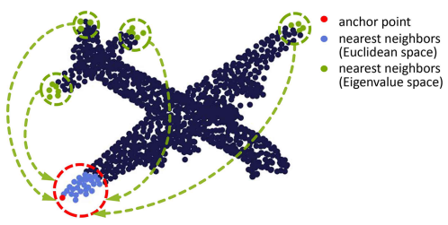
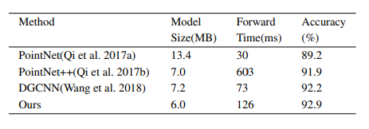
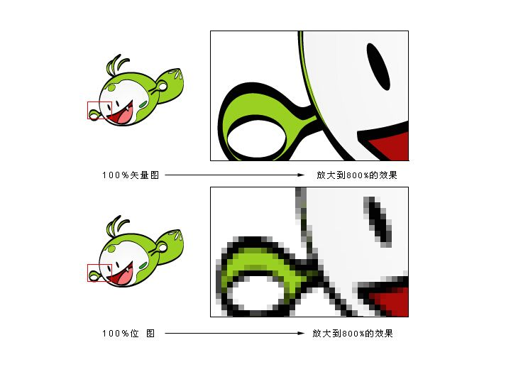

# 上次讨论的实验
1. 在轮廓上搜最短路径
  - 结构：轮廓(取32个轮廓，每个包含64个点) GRU(128) MLP(1024) MaxPooling FC

# DGCNN
1. Input: 点云`X[N, 3]`
2. 通过KNN获得索引，进一步得到中心点`X_i[N, k, C]`和邻点`X_j[N, k, C]`
3. 计算边特征：`e = Cat(x_i, x_j - x_i) # [N, k, C]`
4. 升维：`e = MLP(e) # [N, k, C]`
5. Output: `Max(e) # [N, C]`

# GSCNN

1. Input: 点云`X[N, 3]`
2. 通过KNN获得索引，进一步得到中心点`X_i[N, k, C]`和邻点`X_j[N, k, C]`；通过特征值获得索引，进一步得到中心点`X_i[N, k, C]`和特征值邻点`X_j[N, k, C]`
3. 计算边特征：`e = Max(MLP(Cat(x_j, x_j - x_i, x_j_eig, x_j_eig - x_i))) # [N, k, C]`
4. 升维：`e = MLP(e) # [N, k, C]`
5. Output: `Max(e) # [N, C]`

# 新模型

- EigInterpolate CNN(fps(0.1) 64 64 KI9 BN) CNN(fps(0.1) 64 64 KI9 BN, fps(0.1) 128 128 KI9 BN) Cat(256) MLP(1024) MaxMeanPooling() FC(512, 256, 40)
- 93.2 18

# 下一步
- 子递归
- 刷榜、刷对比
- 语义分割，大点云

# 问题
- 掉线
- 搜索架构的算吗
