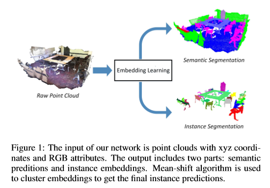
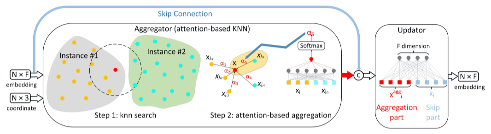
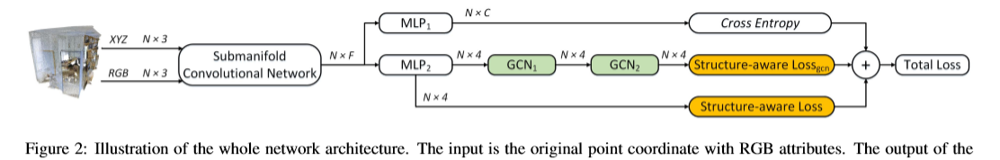

# [3D Graph Embedding Learning with a Structure-aware Loss Function for Point Cloud Semantic Instance Segmentation](https://arxiv.org/pdf/1902.05247.pdf)

本文介绍了一种新的点云三维语义实例分割方法。称为子流形稀疏卷积网络的三维卷积神经网络用于同时生成语义预测和实例嵌入。为了获得每个3D实例的判别嵌入，提出了结构感知损失函数，其考虑**结构信息**和**嵌入信息**。为了为每个3D实例获得更一致的嵌入，建议基于注意力的k最近邻居（KNN）为不同的邻居分配不同的权重。基于基于注意力的KNN，作者在稀疏卷积网络之后添加图形卷积网络以获得重新嵌入。网络可以端到端地进行培训。利用简单的均值漂移算法对重新嵌入的嵌入进行聚类，以获得最终的实例预测。因此，作者的框架可以输出语义预测和实例预测。实验表明，作者的方法优于ScanNet基准测试和NYUv2数据集的所有最新方法。

# 论文动机
- 不同实例之间的特征可能相互污染
# 模型流程
## 注意力GCN

- 构建 KNN 图
- 拼接 xi 和 xj 的特征（不含坐标），通过 MLP 获得一个标量
- 通过 softmax 归一化
- 取所有邻居加权后特征的均值
- 通过一层 MLP 得到卷积结果
## 度量损失

## 前向传播

- 语义分割：
  - 输入是 `N * 6` 的张量，包含坐标 xyz 和颜色 RGB
  - 通过子流形网络获得 `N * F` 的特征嵌入
  - 通过 MLP 降维至 `N * C`
  - 交叉熵
- 实例分割：
  - 通过子流行网络获得 `N * F` 的特征嵌入
  - 通过 MLP 降维至 `N * 4`
  - ①计算度量损失
  - ②通过2层 注意力GCN 后再计算度量损失
# 实验结果

## 语义分割

# 改进方向
- 1、
  - 
# 疑问
- 

# 参考
- 
