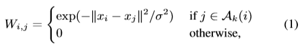
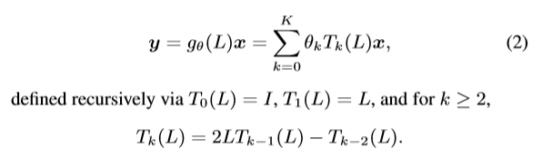
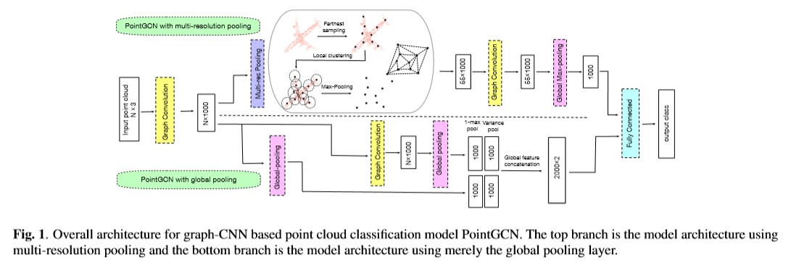
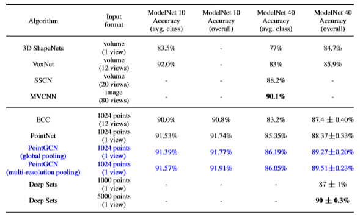
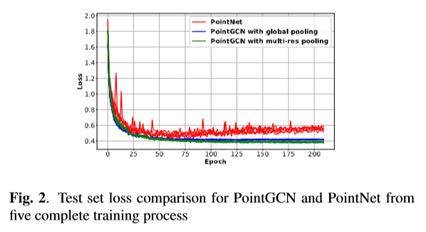
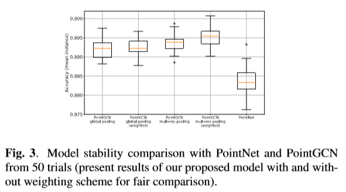

# [A Graph-CNN for 3D Point Cloud Classification](http://arxiv.org/pdf/1812.01711v1.pdf)
图形卷积神经网络（Graph-CNN）扩展了传统的CNN，以处理图形支持的数据。在图上处理数据时的主要挑战是支持集（图的顶点）通常不具有自然排序，并且通常，图的拓扑结构不是规则的（即，顶点并非都是相同的邻居数量）。因此，Graph-CNN具有处理从点状流采样获得的3D点云数据的巨大潜力。在本文中，我们开发了一个GraphCNN，用于分类3D点云数据，称为PointGCN。该架构将本地化图形卷积与两种类型的图形下采样操作（也称为池化）相结合。通过使用Graph-CNN对点云局部结构的有效探索，所提出的架构在3D对象分类基准ModelNet上实现了竞争性能，并且我们的架构比竞争方案更稳定。

# 论文动机
- 在点云结构上构造谱卷积
# 模型流程
## 图卷积

- 利用 KNN 构造图，利用高斯核对每个边加权，其中 A(i) 是顶点 i 的 k 个最近邻居的集合。

- 将卷积核定义为 L(归一化拉普拉斯) 的函数，可近似为 L 的多项式，使用切比雪夫多项式对其进行逼近，因此卷积核是 k 个可学习的权重 + 1 个偏置。（原文中推理傅里叶变换只是放到谱域上做解释）
## 前向传播

- 通过一层 GCN 升维至 1000
- 多分辨率模型（上半部分）：
  - 利用 FPS 采样
  - 对采样点的 50k 邻近做 MaxPooling，获得 `采样点数量 * 1000` 的局部全局特征
  - 通过一层 GCN，维度不变
  - MaxPooling 获得全局特征 1000 维的向量
  - 全连接
- 全局池化模型（下半部分）：
  - 直接全局 MaxPooling 和 逐通道计算方差 + 先经过一层 GCN 再池化
  - 拼接
  - 全连接
# 实验结果
## ModelNet分类

- 1 view 代表仅使用一个视图的点云
## ModelNet40 训练loss走势

- PointGCN 更稳定
## 稳定性实验

- 50次实验的实例平均准确率盒形图
## 突出点可视化

# 改进方向
- 1、
  - 
# 疑问
- 

# 好句
- Previous work has taken different approaches to classifying 3D point clouds [14, 15, 16, 17, 18, 19, 20, 21], including rendering and processing a collection of 2D images (projections of the points onto an image plane from different perspectives), or binning the points into voxels. However, the former involves extensive data augmentation, preprocessing and heavy computation, and the latter introduces discretization error as well as use a relatively sparse format to represent the 3D data. 

# 参考
- 
