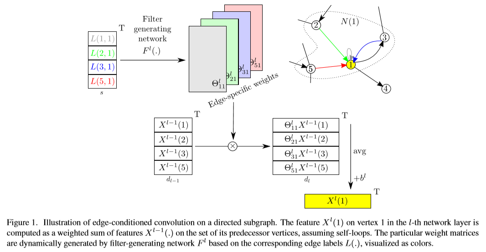
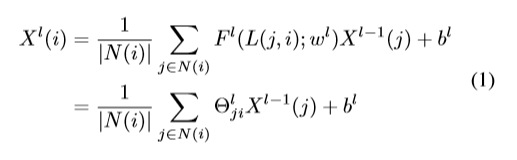
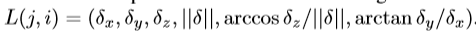
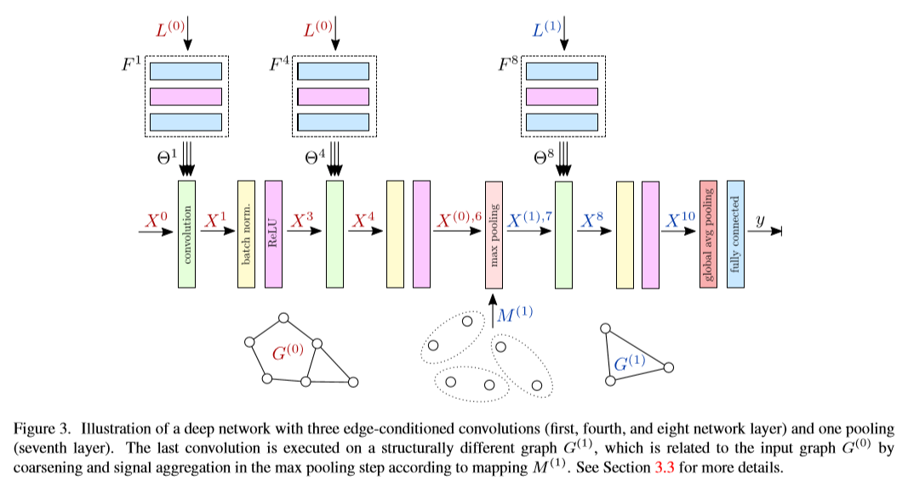
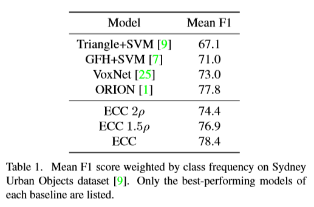
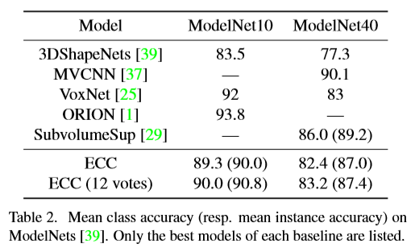
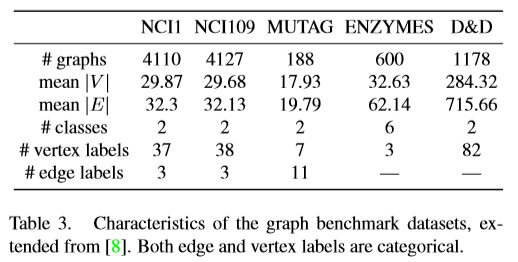
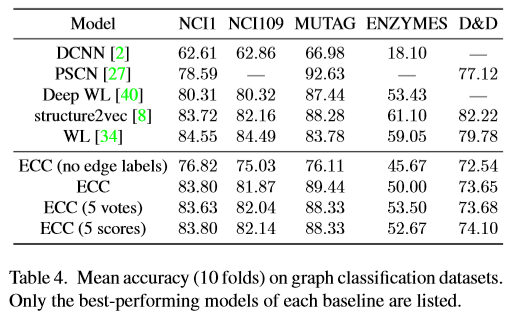
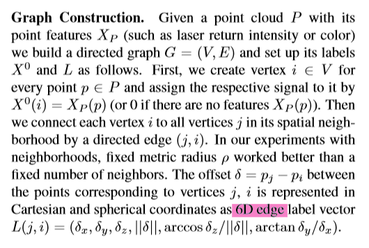

# [Dynamic Edge-Conditioned Filters in Convolutional Neural Networks on Graphs](http://openaccess.thecvf.com/content_cvpr_2017/papers/Simonovsky_Dynamic_Edge-Conditioned_Filters_CVPR_2017_paper.pdf)
在图结构数据的预测中，存在着许多问题。在这项工作中，我们将卷积算子从规则网格推广到任意图，同时避免了频谱域，这使得我们可以处理不同大小和连通性的图。为了超越简单的扩散，过滤器的权重取决于顶点附近的特定边缘标签。结合图粗化的正确选择，探讨了构建深度神经网络进行图分类的方法。特别地，我们在点云分类中展示了我们的公式的通用性，在点云分类中我们设置了最新的技术状态，在图分类数据集中，我们的表现优于其他深度学习方法。

# 论文动机
- 将卷积算子从规则网格推广到任意图

# 模型流程
## 边缘条件卷积

- δ = pj −pi
- F 是 MLP
## 前向传播

- 通过 2层ECC + 1层VoxelGrid体素格点池化 + 1层ECC + 全局平均 + 全连接
- L 代表边，池化后 L 变更
- 体素池化：构建一个3D体素网格，将每个单位立方体内的点云换成立方体质心，通过 MaxPooling 函数进行赋值
# 实验结果
## Sydney Urban Objects 分类

- 1.5ρ 代表卷积时球域半径变成原来的 1.5 倍
## ModelNet 分类

- 那时候 PointNet 应该还没出
- 12 votes 代表在 12 个不同角度的点云上进行预测后投票得到结果
- 其他的模型有的是一次性输入 12 个点云的，输入不太一样
## 图数据集 benchmark

# 改进方向
- 1、
  - 
# 疑问

- 后面俩维是什么意思？

# 参考
- 
