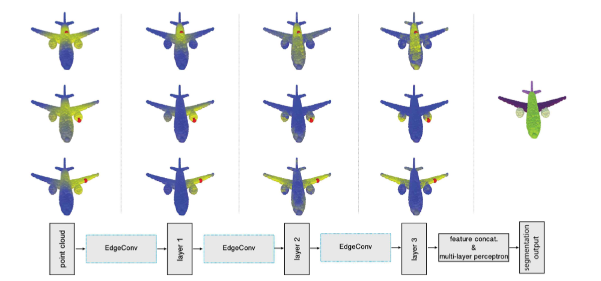
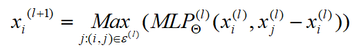
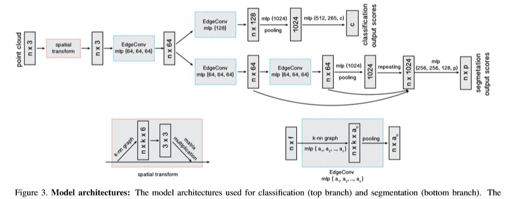

# [Dynamic Graph CNN for Learning on Point Clouds](https://arxiv.org/pdf/1801.07829.pdf)

点云提供了一种灵活和可伸缩的几何表示，适用于计算机图形学中的无数应用程序;它们还是大多数3d数据提取设备的原始输出的一部分。因此，直接作用于点云的智能计算模型是至关重要的，特别是当考虑到效率，排除了昂贵的去噪和网格化过程的可能性时。虽然手工设计的点云特征在图形和视觉领域早已被提出，但是最近卷积神经网络(CNNs)在图像分析方面取得的巨大成功表明，将CNN的视角应用到点云世界的价值。为此，我们提出了一种新的神经网络模块EdgeConv，它适用于基于cnn的点云高级任务的分类和分割。EdgeConv是可微的，可以插入到现有架构中。与主要在外部空间运行或独立处理每个点的现有模块相比，EdgeConv具有几个吸引人的特性:它包含了**局部邻域信息**;它可以叠加或递归地应用于学习**全局形状属性**;而在多层系统中，特征空间的亲和性捕获了原始嵌入中潜在的长距离语义特征。除了提出这个模块，作者还提供了广泛的评估和分析，揭示了EdgeConv捕获和利用点云的细粒度几何特性。该方法在ModelNet40和S3DIS等标准基准上实现了最先进的性能。

# 论文动机
- PointNet忽略了局部信息，而它的许多变体考虑在**局部范围**内获取点集**全局**特征（比如 PointNet++），忽略了点和点之间的**几何结构**，丢失了部分信息
# 模型流程
## 卷积公式

- 邻节点取近邻 K，距离根据 l 层特征差分计算，逐层更新近邻图
- 引入了全局坐标 xi
## 前向传播

- 分类
  - 把各个点的坐标和K邻近相对坐标串联获得 `n * k * 6` 的张量
  - 通过一个Edge
- 语义分割
# 实验结果

# 改进方向
- 1、聚合操作可以改为 ∑ 与 Max 的串联
- 2、
# 备注
- 
# 疑问
# 参考
- 
