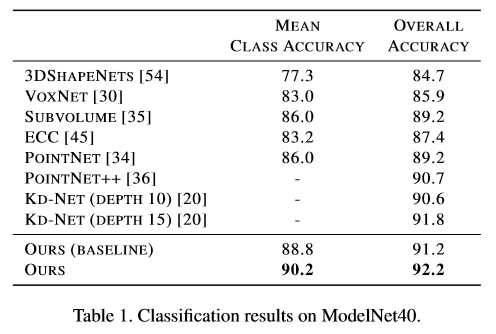
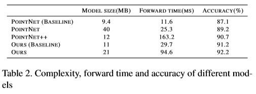
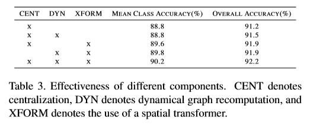
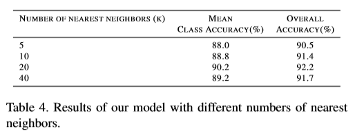
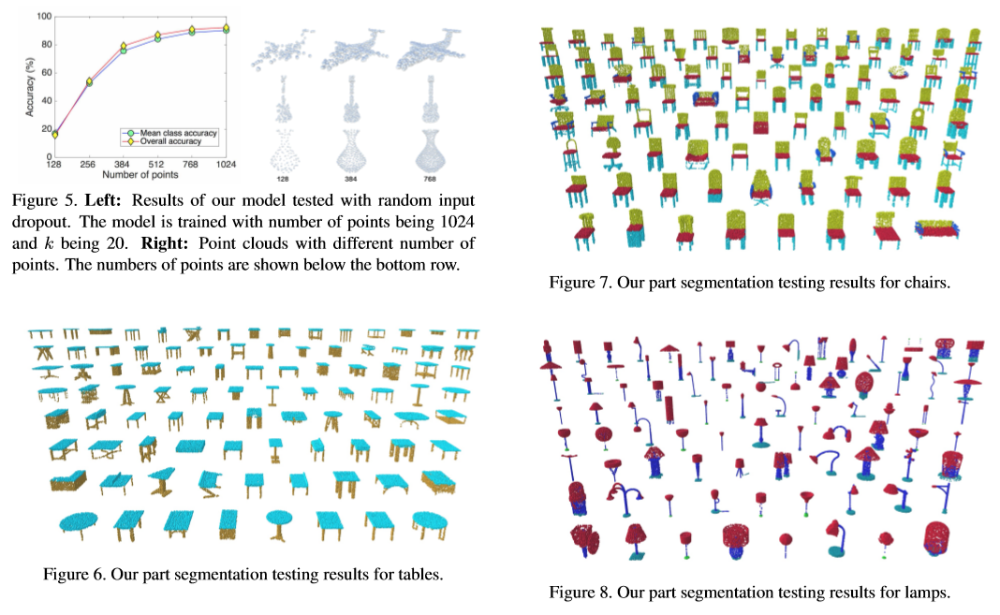
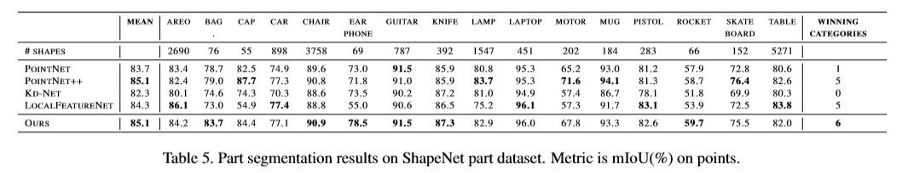
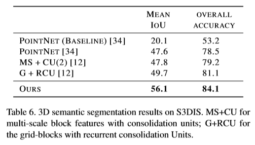
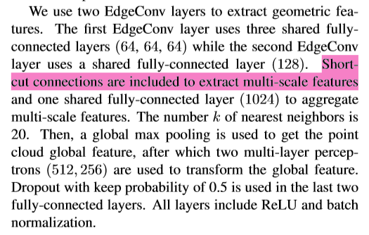

# [Dynamic Graph CNN for Learning on Point Clouds](https://arxiv.org/pdf/1801.07829.pdf)

点云提供了一种灵活和可伸缩的几何表示，适用于计算机图形学中的无数应用程序;它们还是大多数3d数据提取设备的原始输出的一部分。因此，直接作用于点云的智能计算模型是至关重要的，特别是当考虑到效率，排除了昂贵的去噪和网格化过程的可能性时。虽然手工设计的点云特征在图形和视觉领域早已被提出，但是最近卷积神经网络(CNNs)在图像分析方面取得的巨大成功表明，将CNN的视角应用到点云世界的价值。为此，我们提出了一种新的神经网络模块EdgeConv，它适用于基于cnn的点云高级任务的分类和分割。EdgeConv是可微的，可以插入到现有架构中。与主要在外部空间运行或独立处理每个点的现有模块相比，EdgeConv具有几个吸引人的特性:它包含了**局部邻域信息**;它可以叠加或递归地应用于学习**全局形状属性**;而在多层系统中，特征空间的亲和性捕获了原始嵌入中潜在的**长距离**语义特征。除了提出这个模块，作者还提供了广泛的评估和分析，揭示了EdgeConv捕获和利用点云的细粒度几何特性。该方法在ModelNet40和S3DIS等标准基准上实现了最先进的性能。

# 论文动机
- PointNet忽略了局部信息，而它的许多变体考虑在**局部范围**内获取点集**全局**特征（比如 PointNet++），忽略了点和点之间的**几何结构**，丢失了部分信息
# 模型流程
## 卷积公式

- 邻节点取近邻 K，距离根据 l 层特征差分计算，逐层更新近邻图
- 引入了全局坐标 xi
## 前向传播

- 分类
  - 把各个点的坐标和K邻近相对坐标串联获得 `n * k * 6` 的张量
  - 通过一个 EdgeCov mlp{64, 128} 得到 `n * 128` 的张量
  - 通过 MLP 升维至 1024
  - 列 MaxPooling
  - MLP {512, 256, 9} 得到变换矩阵
  - 通过 2 层 EdgeConv 获得张量 `n * 128`
  - 升维至 1024 后做 列MaxPooling 得到 1024 维全局向量
  - 全连接至分类类别数 c
- 语义分割
  - 姿态矫正后经过 3 个 64 维输出的 EdgeConv
  - 升维至 1024 后做 列MaxPooling 得到 1024 维全局向量
  - 串联最后两个 EdgeConv 的经过和 重复 n 次的全局向量获得张量 `n * (64 + 64 + 1024)`
  - NIN 卷积降维至节点类别数 p
# 实验结果
## ModelNet40分类

- baseline是指无 T-Net，并使用固定的 KNNG
## ModelNet40模型尺寸/效率对比

## ModelNet40消融实验

- CENT表示使用xi和xi-xj串联而不是xi和xj
- DYN表示更新KNNG
- XFORM表示T-Net
## 超参数 K 实验

## 鲁棒性实验

- 训练点数为1024，k为20
## ShapeNet部件分割

## S3DIS室内场景语义分割

# 改进方向
- 1、聚合操作可以改为 ∑ 与 Max 的串联
- 2、更新KNNG破坏了固有的本地信息
  - 可以把坐标固定地串联在特征前面
# 疑问

- 第8页第1段，作者没说清楚到底怎么连接的捷径层，图上没给出
# 参考
- [CSDN 论文笔记](https://blog.csdn.net/hongbin_xu/article/details/85258278)
