# [Modeling Point Clouds with Self-Attention and Gumbel Subset Sampling](http://arxiv.org/pdf/1904.03375v1.pdf)
由于3D传感器的普及，几何深度学习变得越来越重要。受NLP域的最新进展的启发，引入自注意变换器以消耗点云。我们开发了点注意变压器（PAT），使用参数高效的组合注意力（GSA）来代替昂贵的多头注意力。我们展示了它处理大小变化输入的能力，并证明了它的置换等价性。此外，先前的工作使用启发式依赖于输入数据（例如，最远点采样）来分层地选择输入点的子集。因此，我们首次提出了一种名为Gumbel子集采样（GSS）的端到端可学习和任务相关的采样操作，以选择输入点的代表性子集。配备Gumbel-Softmax，它在训练阶段产生“软”连续子集，在测试阶段产生“硬”离散子集。通过以分层方式选择代表性子集，网络以较低的计算成本学习输入集的更强表示。分类实验和分类基准测试表明了我们方法的有效性和有效性。此外，我们提出了一种新颖的应用，将事件相机流处理为点云，并在DVS128手势数据集上实现最佳性能。

# 论文动机
- 引入自注意变换器
- 可微子集采样代替置换有变的 FPS

# 模型流程
## ARPE 绝对相对位置嵌入
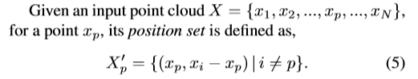

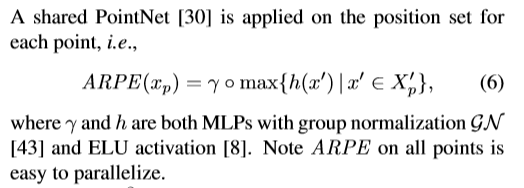
- 对于每个点 p，获得一组 K 近邻集合｛xp，xi-xp for i in K｝
- 使用 PointNet(ELU激活) 提取区域集合信息作为 p 点的特征
## GSA 与 GSS
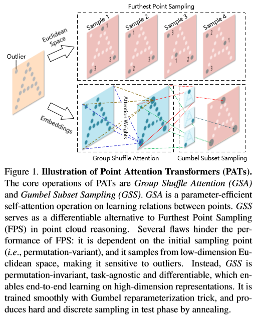

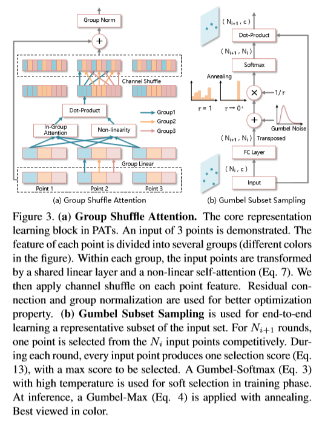
- gumbel 在训练阶段使用软连接传递梯度并逐渐退火至多项式分布，在测试阶段使用硬连接
### GSA 自注意变换器
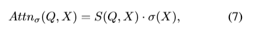
- S(Q,X) = softmax(QX^T/√c), 此处 √c 用于控制内积尺度，避免 softmax 非 1 即 0
- σ 为 ELU 函数

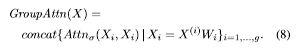
- 分组式高效多头自注意力
- 参考 MobileNet 的 depth-wise，将 x 按通道分为多组，每组组内共享一个线性变换矩阵 W，然后通过自注意力机制获得同通道数的变换后的 wx（注意此处是wx，相较于x，其通道意义已经被改变）

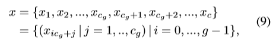
- 将多组通道拼接

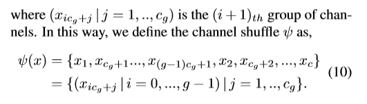
- 按规则 shuffle

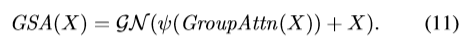
- 与原 x 进行快捷连接
- 通过 GN（group normalization） 调整分布
### GSS Gumbel子集采样
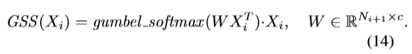
- 受 Attention-based MIL pooling 启发，作者使用类似手法对点集进行可微池化
- 此处使用 gumbel 是因为作者认为直接使用 softmax 的池化是**不可追溯的**和**难以解释的**
- 相当于在点上做 N(i+1) 次选择，下标代表层数
## 前向传播
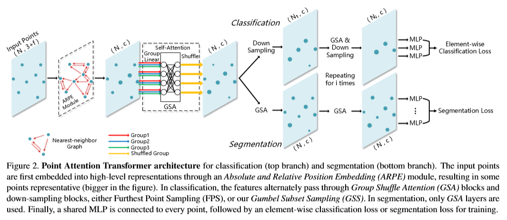
- 语义分割模型不采用下采样
- element-wise loss 代表使用 共享MLP 对剩下的每个点分别输出预测结果，然后算平均交叉熵损失，作者称这样可以加速训练，对最终结果无影响
# 实验结果
## ModelNet40
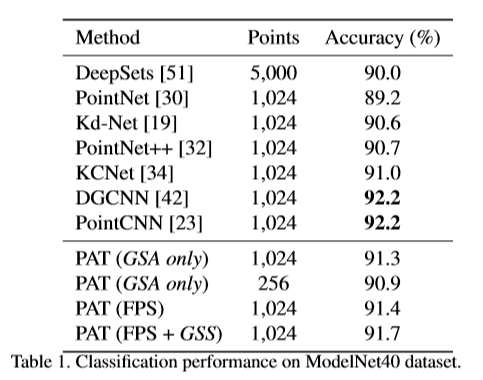
- Although GSS is theoretically superior to FPS, the Gumbel noises also serve as a (too) strong regularization. Instead of using GSS in all down-sampling, we find that replacing the first down-sampling with FPS performs slightly better in our experiments.

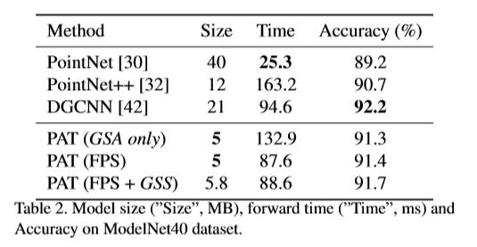
- 如图所示，我们的模型以极高的参数量和可接受的速度实现了竞争性能。由于PyTorch（0.4.1）中组线性层的支持不足，低水平实施优化仍然存在速度的提高。请注意，采用下采样的PAT可以以更低的计算成本实现更好的性能，而GSS可以通过可忽略的负担进一步提高FPS
## S3DIS室内场景分割
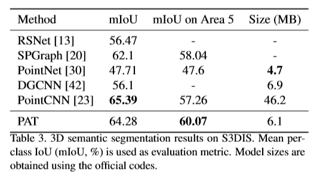

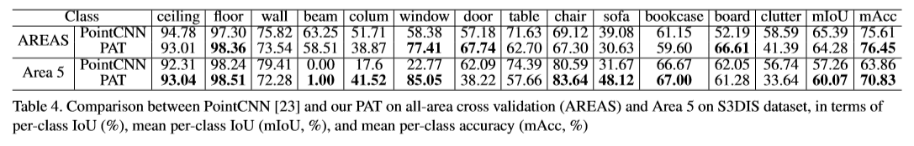
- 为了进一步分析PointCNN和我们的方法之间的性能，我们比较了AREAS和Area5上的每级IoU和平均每级精度（mAcc）。如表4所示，在AREAS上，我们的方法在mAcc方面优于PointCNN;在第5区，我们的方法在mIoU和mAcc方面都优于PointCNN，在大多数类上都优于每级IoU
## 事件相机流作为点云：DVS128手势识别
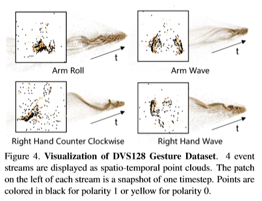
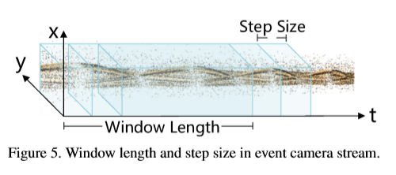
- 动态视觉传感器（DVS）是一种生物启发的事件相机，“仅在像素检测到变化时才传输数据”[1]。在128×128传感器矩阵上，它记录相应位置是否有变化（通过用户定义的阈值），以微秒为单位。

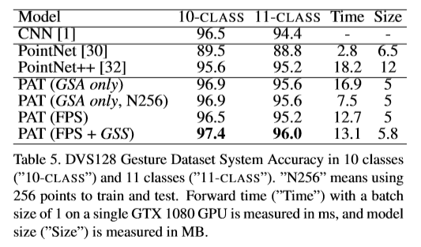
## 消融实验
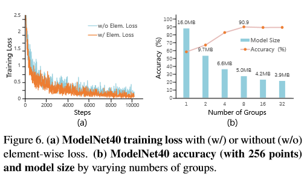
- （a）具有（w /）或没有（w / o）元素损失的ModelNet40训练损失。 （b）ModelNet40精度（256点）和模型大小不同的组数。
- 元素损失，训练往往更快。但是，测试集上的评估没有性能提升。
- 分组对性能至关重要，因为它与多头设计相结合。如果没有分组，模型精度会显着下降，模型尺寸会更大。8组，它实现了精度和模型尺寸之间的最佳平衡。

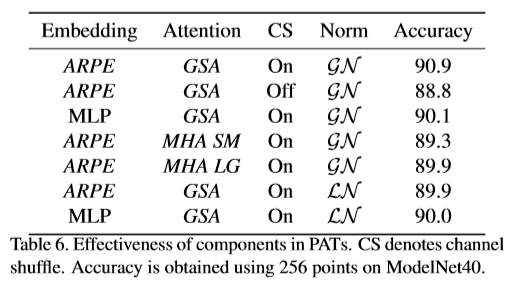
- ARPE模块被证明对提高性能非常有效（表6中的“MLP”或“ARPE”）。它在256或1,024点上持续改善约0.8％。
- 为了使信息能够跨群组流动，信道shuffle对于GSA（表6中的CS“开”或“关”）是至关重要的，这是无参数的并且引入了可忽略的计算成本。
- 我们设计了两个MHA对应物来比较：1）MHA LG，具有与GSA相同的隐藏尺寸，以及2）MHA SM，通过调整隐藏尺寸以保持与GSA相当的模型尺寸。如表6所示，我们的GSA PAT在参数效率和准确性方面表现出优异的性能。
- 我们还讨论了原始多头注意[39]中的层标准化LN [3]。由于GN被认为是LN的扩展，在我们的实验中（表6中的GN或LN），前者（ 8）始终优于后者。
# 改进方向
- 1、
  - 
# 疑问
- 

# 参考
- 
