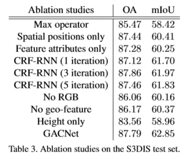

# [Graph Attention Convolution for Point Cloud Segmentation](https://engineering.purdue.edu/~jshan/publications/2018/Lei%20Wang%20Graph%20Attention%20Convolution%20for%20Point%20Cloud%20Segmentation%20CVPR2019.pdf)
  标准卷积由于其特征的各向同性，在语义点云分割中存在固有的局限性。它忽略了物体的结构，导致分割结果中对物体轮廓的描述较差，有小部分伪区域。作者提出了一种新的图形注意卷积(GAC)，它的卷积核可以被动态地雕刻成特定的形状，以**适应对象的结构**。具体来说，GAC通过给不同的相邻点分配特定的注意权重，根据它们的特点选择性地聚焦于它们最相关的部分。卷积核的形状是由学习到的注意权值分布决定的。GAC虽然简单，但是可以捕捉点云的结构化特征，进行**细粒度**分割，避免了对象之间的**特征污染**。从理论上讲，我们对GAC的表达能力进行了深入的分析，展示了它如何学习点云的特征。经验上，通过对室内和室外数据集的挑战实验，我们提出的GAC在现有的深度学习方法的基础上，展示了最先进的性能。
# 论文动机

- 标准图卷积具有**各向同性**，如上图左，对来自不同方向的节点一视同仁。GAC 旨在利用**注意力**机制为不同的相邻点分配不同权重，避免**特征污染**。
  - Left: The weights of standard convolution are determined by the neighbors’ spatial positions, and the learned feature at point 1 characterizes all of its neighbors indistinguishably.
  - Right: In GAC, the attentional weights on ”chair” (the brown dotted arrows) are masked, so that the convolution kernel can focus on the points of ”table”.

# 模型流程

- 

# 伪代码

# 实验结果

# 改进方向
- 注意力机制的输入只有｛相对位置，特征差分｝
  - 可以参考归一化的拉普拉斯阵，除了考虑聚合节点 i 的度 Di，还应该考虑被聚合节点 j 的度 Dj [参考：空域角度GCN](https://www.zhihu.com/question/54504471/answer/611222866)
  
  

- 没有 Bn层，如果层数加深应该增加
- 注意力机制感受野太小
  - 由于网络结构不深，注意力机制所观察到的结构范围很有限，可以引入全局信息，参考 PointNet
# 疑问
