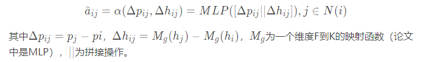

# [Graph Attention Convolution for Point Cloud Segmentation](https://engineering.purdue.edu/~jshan/publications/2018/Lei%20Wang%20Graph%20Attention%20Convolution%20for%20Point%20Cloud%20Segmentation%20CVPR2019.pdf)
  标准卷积由于其特征的各向同性，在语义点云分割中存在固有的局限性。它忽略了物体的结构，导致分割结果中对物体轮廓的描述较差，有小部分伪区域。作者提出了一种新的图形注意卷积(GAC)，它的卷积核可以被动态地雕刻成特定的形状，以**适应对象的结构**。具体来说，GAC通过给不同的相邻点分配特定的注意权重，根据它们的特点选择性地聚焦于它们最相关的部分。卷积核的形状是由学习到的注意权值分布决定的。GAC虽然简单，但是可以捕捉点云的结构化特征，进行**细粒度**分割，避免了对象之间的**特征污染**。从理论上，作者对GAC的表达能力进行了深入的分析，展示了它如何学习点云的特征。经验上，通过对室内和室外数据集的挑战实验，作者提出的GAC在现有的深度学习方法的基础上，展示了最先进的性能。
# 论文动机

- 标准图卷积具有**各向同性**，如上图左，对来自不同方向的节点一视同仁。GAC 旨在利用**注意力**机制为不同的相邻点分配不同权重，避免**特征污染**
  - Left: The weights of standard convolution are determined by the neighbors’ spatial positions, and the learned feature at point 1 characterizes all of its neighbors indistinguishably.
  - Right: In GAC, the attentional weights on ”chair” (the brown dotted arrows) are masked, so that the convolution kernel can focus on the points of ”table”.

# 模型流程
## 注意力权重

- 对于每一个定点，以当前节点和周围节点的**相对位置**、**特征差分**作为输入，预测出对应权重值 α，并对**同一通道**的所有特征做 **SoftMax**，以缓解密度问题
- 3：点云坐标，F：旧层特征维度，K：新层特征维度
### 权重计算

### 权重归一化

- N(i) 代表节点 i 的邻域（自身 + 一阶邻节点）
## 卷积聚合

- 这里 `*` 代表哈达玛积（element-wise production of two vectors）
## 前向传播

- GACNet 利用 FPS 在点云中采样
- 为每个采样点划一个 k 为半径的球域，在球域内随机采样固定个数邻点
- 利用相对位置和特征差分计算邻点 attention 权重
- 注意力卷积以更新根节点信息
- 下采样层直接返回更新后的采样点
- 上采样先对采样点做NIN卷积然后采用插值+直连的方法上采样
- 再通过一层NIN卷积
- 交叉熵分类

# 实验结果
## 语义分割

- Table1 S3DIS dataset
  - 室内数据集，包含3D坐标+传感器信息（height, RGB, and geo-feature），13个类别
  - 评估方式：总准确率，类IOU，平均IOU
- Table2 Semantic3D dataset
  - 城市、乡村雷达数据集，包含3D坐标+RGB信息+强度，8个类别
  - 作者注意到在这个实验中，人造地形和自然地形在GACNet上相对难以分割，因为在容易混淆的区域中存在大量的点没有出现在训练集中
  
  

## 消融实验和鲁棒性测试

- 注意力分布 → Max ：效果降低
- GAC 最后一层 → CRF 层 ： CRF 的迭代没有显著提高精度，证明 GAC 与 CRF 有类似的特性，可以代替它鼓励相似点获得类似 feature 和 label
- 只使用部分 feature 信息：效果降低

- 上: 失去△h的实验结果不好
- 左：利用 priori knowledge 计算的人工特征对网络准确率提升微弱
- 右：加上高斯扰动后在 ModelNet40 上在准确率走势

# 改进方向
- 1、注意力机制的归一化操作仅考虑自身节点，缺乏邻域节点度信息
  - 可以参考归一化的拉普拉斯阵，除了考虑聚合节点 i 的度 Di，还应该考虑被聚合节点 j 的度 Dj [参考：空域角度GCN](https://www.zhihu.com/question/54504471/answer/611222866)
  
  

- 2、可以增加对于注意力的 Angular Margin Loss 以显式地极化注意力分布 [参考：Arcface](https://blog.csdn.net/Wuzebiao2016/article/details/81839452)
- 3、上采样层忽略了局部邻域信息
  - 上采样过程同 PointNet++ 仅利用 NIN卷积 进行维度升降和插值，忽略了邻域信息。而浅层感受野较小，难以获取全局信息，在深层拥有能更好地控制注意力的全局信息时又不采用卷积，抛弃了局部信息，应该在逐层插值之后再进行卷积
- 4、结构感受野限定
  - 注意力机制的参考点为｛一阶相对位置，一阶特征差分｝，仅考虑了一阶邻域内的结构特征，不能通过网络层级的提升获得更高的感受野即无法获得二阶邻域的结构特征（混淆在特征中的信息也因为差分操作被削弱），可以 ①扩大参考点范围 ②逐层卷积聚合邻域结构特征 ③引入中心坐标系或全局信息
- 5、下采样部分没有快捷连接
  - 虽然网络利用 U-Net 结构在上采样部分引入恒等映射，但对于下采样部分却没有，可以引入线性层构造残差学习 [参考：ResNet 第三页公式2](https://arxiv.org/pdf/1512.03385.pdf)
- 6、逐层池化不仅破坏特征信息还破坏了结构信息
  - 引入胶囊，将低层次的信息传递到被认为能最好地处理这些信息的胶囊 [参考：CapsNet](https://baijiahao.baidu.com/s?id=1622872284216471702&wfr=spider&for=pc)
- 7、FPS 采样对噪声鲁棒性不强，且继承了疏密问题
  - 考虑排除 outer，或构建可学习的采样方式
  - 制作超点图进行降维 [参考：SPG](http://www.sohu.com/a/247222177_715754)
- 8、透视角度易引起点云采样不均，疏密程度受影响，除此之外网络也应该对物体的刚性变换具有强鲁棒性
  - 引入空间变换网络对点云进行仿射矫正 [参考：STN](https://www.baidu.com/link?url=noWevhNKsUMfL7RispH0p6tT7J-8lF8ipCSFu74Gwr2H9RlSJEe0pP0ObYiCSpYRh2P3JXWFtnyldifrbdNWJPn10A8bgvrcJdhFKdBnr3y&wd=&eqid=8210883800000b8e000000035ceef5bd)
- 9、注意力模块中使用 MLP 对 相对位置△p 和 特征差分△h 施加非线性变换到 K 维，忽略了球域其他节点的信息（除了归一化部分）
  - 可以对 KNN 排序后的相对值序列做一维卷积，以获取紧邻节点局部特征 [参考：TextCNN](https://www.cnblogs.com/bymo/p/9675654.html)
  - 或以边为节点构造子图
- 10、忽略了特征通道间的相关性
  - 可采用 全局池化 + 门控机制 + sigmoid 对特征通道施加注意力 [参考：SENet](https://blog.csdn.net/wangkun1340378/article/details/79092001)
    - Squeeze 操作对象可以尝试卷积核a而不是卷积结果
- 11、softmax 使得各个新通道对应卷积核的总和为 1，破坏了不同卷积核间应该存在的特征分布
  - 可以在各个不同通道引入可学习的斜率和偏置 [参考：BatchNormalization(scale、shift)](https://www.cnblogs.com/guoyaohua/p/8724433.html)
  - 或将 attention 机制与 w权重分离计算然后求哈达玛积
# 疑问
- 
  - 这里是指双向边吗？
- 理论分析部分看不懂

# 参考
- [CSDN 总结](https://blog.csdn.net/weixin_39373480/article/details/88856169)
- [Pytorch 代码](https://github.com/yanx27/GACNet/blob/master/model.py)
