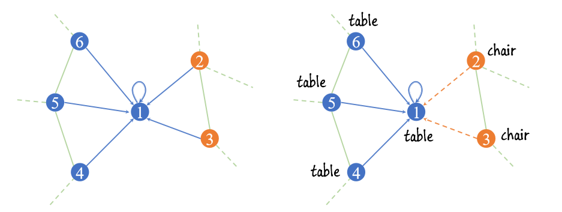

# [Graph Attention Convolution for Point Cloud Segmentation](https://engineering.purdue.edu/~jshan/publications/2018/Lei%20Wang%20Graph%20Attention%20Convolution%20for%20Point%20Cloud%20Segmentation%20CVPR2019.pdf)

# 针对的问题

# 模型流程

# 实验结果

# 不足与改进假设

# 疑问
