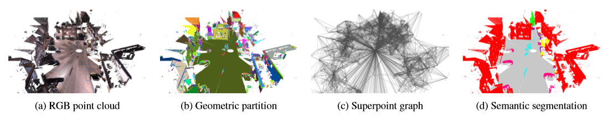

# [Large-scale Point Cloud Semantic Segmentation with Superpoint Graphs](http://openaccess.thecvf.com/content_cvpr_2018/papers/Landrieu_Large-Scale_Point_Cloud_CVPR_2018_paper.pdf)
作者提出一种新的基于深度学习的框架以解决上百万点的大场景点云语义分割面临的挑战。证明了点云的组织可以有效地通过一种称为超点图(superpoint graph, SPG)的结构进行描述，SPG从扫描场景分割成的几何同质元素中得到。SPGs提供一种紧致且具有丰富的描述不同目标部分上下文关系的表达，并为一个图卷积神经网络所利用。作者的框架得到了目前室外及室内LiDAR扫描点云分割的最好结果（Semantic3D点云上提高了11.9%和8.8%，S3DIS数据集上提高了12.4%）。

# 论文动机
- 将三维点云转换到二维格式会造成信息的损失并需要进行表面重建，而这是和语义分割具有相同难度的一个问题。
- 点云的[体素化](https://blog.csdn.net/qq_29952277/article/details/78344258)表达效率较低并趋向于丢失小细节。
- 专为三维点云设计的深度学习框架可以得到较好的结果，但是受到一次可处理的输入点云数的限制。

# 模型流程

- 作者提出一种将大场景三维点云用一系列相互联系的简单形状构成超点的表达方式，这种表达方式与影像分割中的超像素类似。如图1所示，这种结构可以由一种称为超点图(superpoint graph, SPG)的属性有向图结构描述。超点图的节点代表简单的结构，而富有边特征的边描述了它们的连接关系。
  - （a）输入点云 → （b）简单几何形状——超点 → （c）利用富含信息的超边连接附近的超点构成超点图(superpoints graph, SPG) → （d）超点被转换为紧致的嵌入，由图卷积处理以利用上下文信息，并分类得到语义标签

# 实验结果

## 语义分割

# 改进方向
- 1、
  - 
# 疑问
- 

# 参考
- [泡泡点云时空](http://www.sohu.com/a/247222177_715754)
