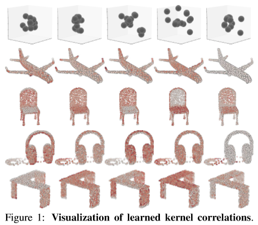
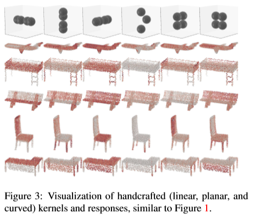
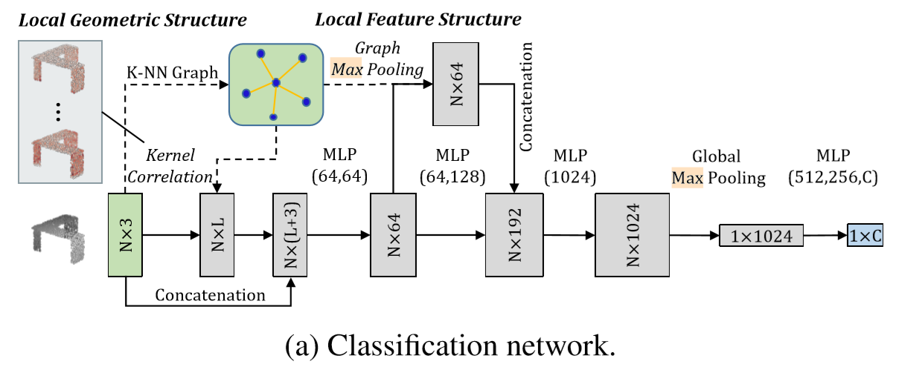
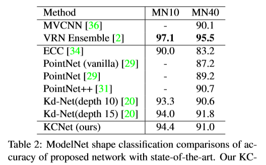

# [Mining Point Cloud Local Structures by Kernel Correlation and Graph Pooling](https://arxiv.org/pdf/1712.06760)
与图像不同，由于自然无序的数据结构，使用深度网络的3D点云的语义学习具有挑战性。在现有的作品中，PointNet通过直接学习点集来取得了可喜的成果。然而，它没有充分利用一个点的局部邻域，其中包含细粒度的结构信息，这有助于更好的语义学习。在这方面，作者提出了两项新的提案，以更有效地利用局部结构来改进PointNet。第一个侧重于局部3D几何结构。类似于图像的卷积核，作者将点集内核定义为一组可学习的3D点，它们根据由**核相关性**测量的几何关系共同响应一组相邻数据点，改编自点云配准的相似性技术。第二个利用局部高维特征和结构，在最近邻图上获得**局部突出特征**。实验表明，作者的网络工作可以有效地捕获本地信息，并在主要数据集上稳健地实现更好的性能。

# 论文动机
- PointNet 无法捕捉**局部信息**
- PointNet++ 速度慢，作者尝试从另一个方向来探索:是否有一种高效的、可学习的局部操作，带有清晰的几何解释，能够在保持 PointNet 简单架构的同时，直接增强和改进原始切入点?

# 模型流程
## 核相关
- 作者设计了可学习的3维卷积核，类比2D图像中的卷积核，在空间上数据分布相似时激活值最大

- 学习获得的核对应的响应可视化，红色代表响应大

- 手工设计的核在一些点云上的激活响应
### 加权公式

- σ 为超参，k 和 δ 分别代表核中某一参数的三维坐标和根节点周围某一邻点的相对坐标
- 用于度量两个点之间的相似度
- 高斯核：距离越远，激活值呈指数级衰减
### 核相关卷积公式

- k：某一个核；km：k的第m个参数；N(i):邻域节点；Kσ：激活值（类比2D卷积中的wx）
- 此公式用于度量俩核图之间的相似性
## 前向传播
- 符号解释：MLP(第一层输出维度，第二层输出维度，……)

 
- （a）点云分类
  - 利用 KNNG 得到的邻域图与 L 个核图，分别对每个点做核相关计算得到 L 个尺寸为 N 的点集特征图 `N * L`
  - 拼接到3D坐标后得到 `N * (L + 3)` 的特征图
  - 通过 NIN卷积 升维至64
  - 利用 KNNG 对每个点每个通道做 MaxPooling 得到某个点的局部特征图 `N * 64` 后拼接到原图 NIN卷积 升维后的特征图上，得到 `N * 192` 的特征图
  - NIN卷积 升维到 1024后逐通道做 MaxPooling 得到全局特征向量
  - 全连接输出结果
  
 
- （b）语义分割
  - 基本一致，只是把每层的结果拼接在一起作为一个点的全部通道特征，经过 NIN卷积 后得到每个点的 label
# 实验结果
## MNIST手写数字2D点云分类

## ModelNet形状分类

## 模型参数与推理效率

## ShapeNet部件语义分割

## 消融实验

## 超参数实验

## 鲁棒性实验

# 改进方向
- 1、图池时忽略了边的信息
  - 使用距离进行加权平均/最大池化
# 备注
- PointNet直接将xyz坐标当作通道特征，其输入为 `点数 * 坐标数 = N * 3` 的矩阵
# 疑问
- 
# 参考
- [泡泡点云时空](https://www.sohu.com/a/251288633_715754)
