# [Point2Sequence: Learning the Shape Representation of 3D Point Clouds with an Attention-based Sequence to Sequence Network](https://arxiv.org/pdf/1811.02565v2.pdf)
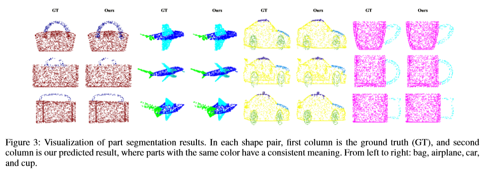

探索当地区域的背景信息对于形状理解和分析非常重要。现有研究通常采用手工制作或显式方式编码本地区域的背景信息。然而，很难以手工制作或明确的方式捕捉细粒度的背景信息，例如局部区域中不同区域之间的相关性，这限制了学习特征的辨别能力。为了解决这个问题，我们提出了一种新的3D点云深度学习模型，名为Point2Sequence，通过以新颖的隐式方式捕获细粒度的上下文信息来学习3D形状特征。Point2Sequence采用一种新的点云序列学习模型，通过聚焦每个局部区域的多尺度区域来捕获相关性。具体而言，Point2Sequence首先了解局部区域中每个区域尺度的特征。然后，它使用基于递归神经网络（RNN）的编码器 - 解码器结构来捕获在聚合所有区域尺度的过程中的区域尺度之间的相关性，其中提出了注意机制以突出不同区域尺度的重要性。实验结果表明，Point2Sequence在形状分类和分割任务中实现了最先进的性能。

# 论文动机
- 构建局部区域中多尺度的相关性

# 模型流程
## 多尺度分组
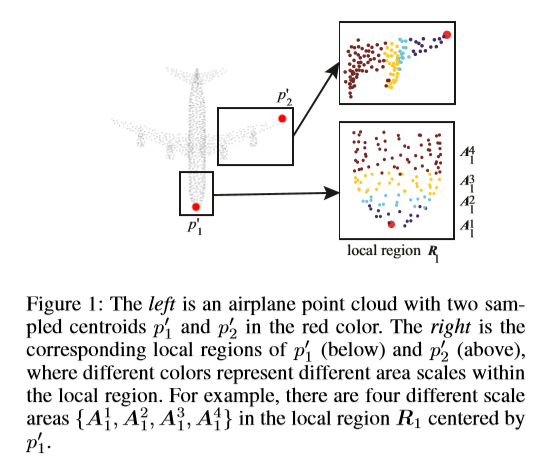
## 前向传播
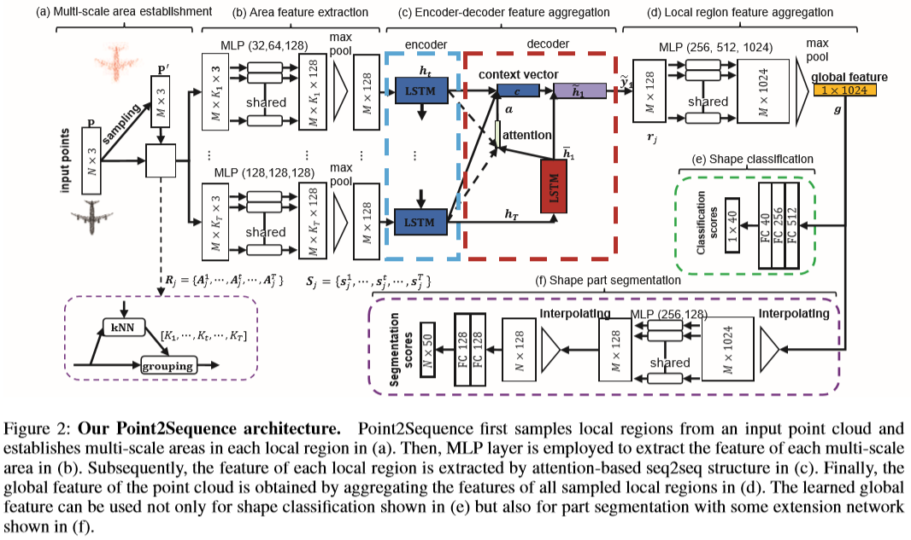
- 前面同 PointNet++
- 得到不同组特征图 `K * M * 128` 与采样点坐标拼接
- 利用 LSTM 对不同尺度特征图编码（P++是直接拼接）
- 利用 LSTM解码器 对最后一个输出的隐状态单步解码（以零状态Z0为输入）
- 利用解码向量和各个尺度编码向量获得注意力上下文信息 c
  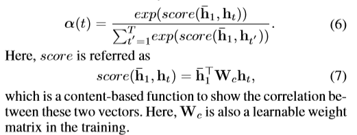
  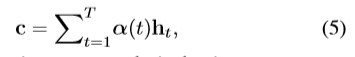
- 更新最终隐状态得到全局信息 ~y1
- 升维至1024
- 后面和 P++ 一样
# 实验结果
## ModelNet 分类
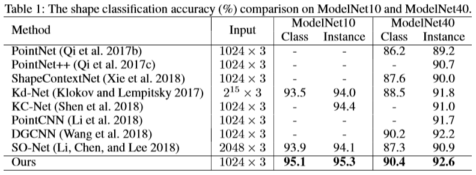
## 消融实验
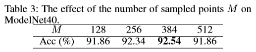

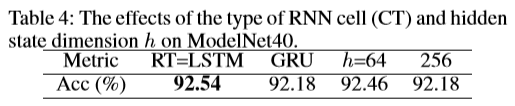
- 原定 lstm, 128

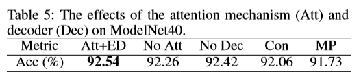
- ATT：注意力 ED：seq2seq结构 Dec：解码器 Con：直接拼接 MP：最大池

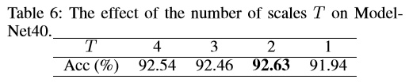
- T：分组个数，始终保留最大组尺寸128
- 4 的设置是(16,32,64,128)，2 的设置是(K1 = 64,K2 = 128)
- 证明 T > 1 效果好

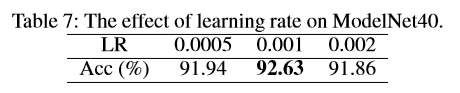
- 这是 T=2 的基础上得到的

# 改进方向
- 1、使用曼哈顿距离而不是欧氏距离
- 2、结构信息丢失
  - 使用 GCN
# 疑问
- Z0 可学习吗？
- 优化器只能用 Adam 吗？
# 参考
