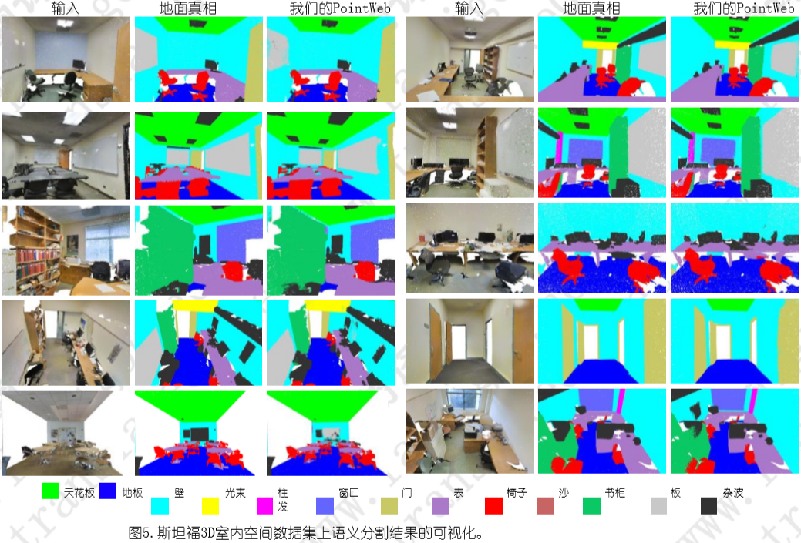
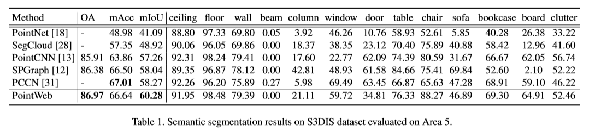
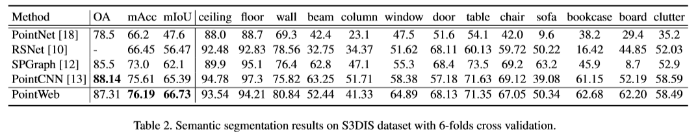
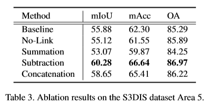
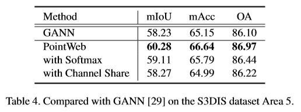
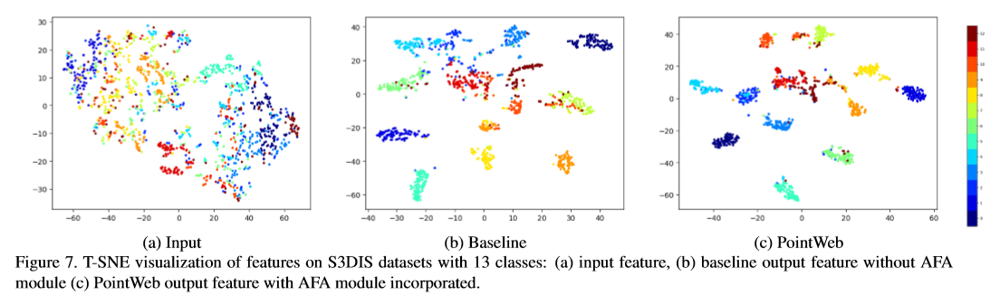
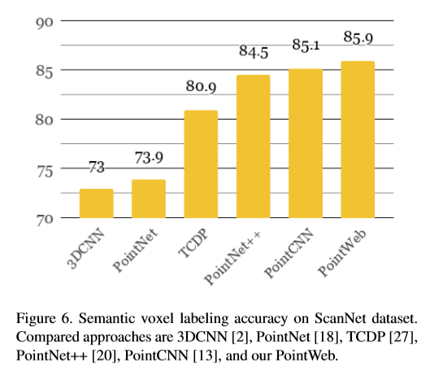
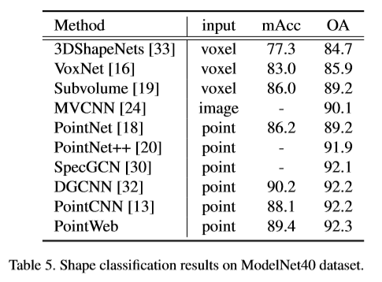

# [PointWeb: Enhancing Local Neighborhood Features for Point Cloud Processing](http://jiaya.me/papers/pointweb_cvpr19.pdf)

本文介绍了 PointWeb ，一种从点云中从局部邻域中 提取上下文特征的新方法。与以前的工作不同，我们 **在局部邻域中将每个点密切地连接在一起**，旨在基于局部区域特征指定每个点的特征以更好地表示该区域。 提出了一种新颖的模块，即自适应特征调整（ AFA ）模 块，用于找到点之间的相互作用。对于每个局部区域， 将具有点对 之间的元素影响的撞击图应用于特征差异图。然后，根据自适应学习的影响指标，由同一区域 中的其他特征拉动或推动每个特征。调整的特征用区 域信息很好地编码，因此有益于点云识别任务，例如 点云分割和分类。实验结果表明，我们的模型在语义分割和形状分类数据集上都优于现有技术。

# 论文动机
- 聚合局部信息，包括根与邻和邻与邻的关系

# 模型流程
## AFA 自适应特征调整

- 参考了力场效应，在局部邻居（i 的 K 近邻）中构建全连接图，根据 j 与 i 的差分学习残差

- imp 代表影响力， rel 代表关系

- a 是 element-wise 的
- 总结起来就是 △F = MLP(-diff) * diff，其中 diff = Fj - Fi if i ≠ j else Fi，有点像引力和斥力
## 前向传播

- 整体架构参考 PointNet++，但是在MLP之前增加了 AFA 模块

# 实验结果
## S3DIS 室内场景语义分割

-  PointWeb 很好地捕获点云中的某些详细结构。如图所示，不显眼的物体部分，如椅子和桌子的腿，可以被准确地区分和识别。最后一行显示了两个失败案例。在左图，墙上的部分杂乱被错误分类为板。在第二个中， 墙上的杂乱部分在我们的算法中被识别，但在标签中没有。左边的部分杂乱与书柜混合在一起。
## 消融实验

- 研究图3中 combine 的方法
- 基线就是 P++(不包含 f imp 和 f rel，此图消融实验仅消融 f imp)
- 在不与其他功能交互的情况下对单个功能进行学习调整无法收集本地区域上下文
- 成对特征的求和操作导致地方特征的判别能力下降，因此损害了识别能力。因为 Fj 对 Fi 的影响变得与 Fi 对 Fj 的影响相同，这种类型的对称冲击产生了不理想的性质
- 成对特征的连接使得特征表示的一部分几乎相同，这使得 Fi 在计算影响时占主导地位，不如减法选择那么好
- 通过减法运算，每个特征对 Fi 和 Fj 之间的组合是唯一的，从而提高了分类能力
- 此外，直接对特征施加影响因子（f rel （F i ，F j ）= F j ），测试结果为59.79％/ 66.63％/ 86.51％（对于mIoU / mAcc / OA） ）。不如在差异图（f 相对 （F i ，F j ）= F i F j ）上运行的影响 特征一样好，其产生的最高性能为60.28 / 66.64 / 86.97（％）

- 关于 w 的消融
## TSNE 降维分析

## ScanNet 语义分割

## ModelNet 分类

# 改进方向
- 1、
  - 
# 疑问
- 

# 参考
- 
