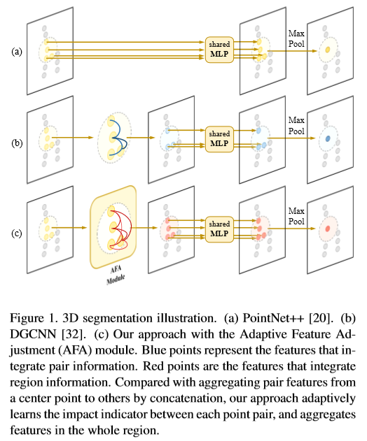
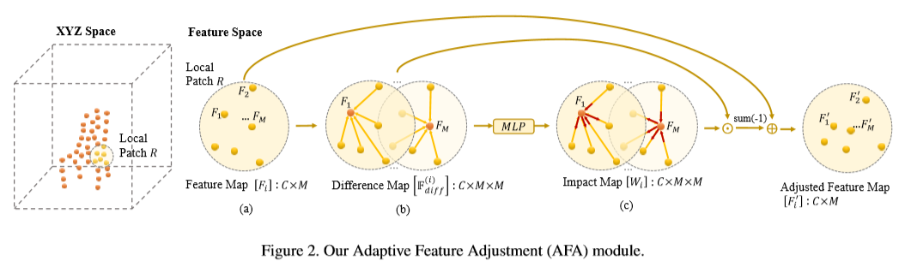
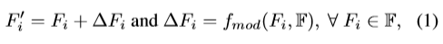
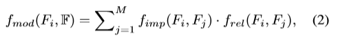
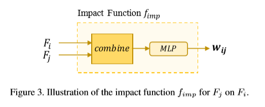
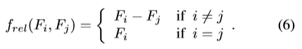
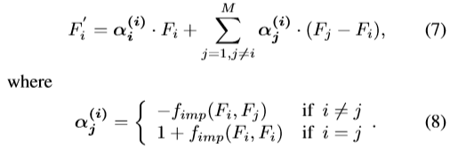
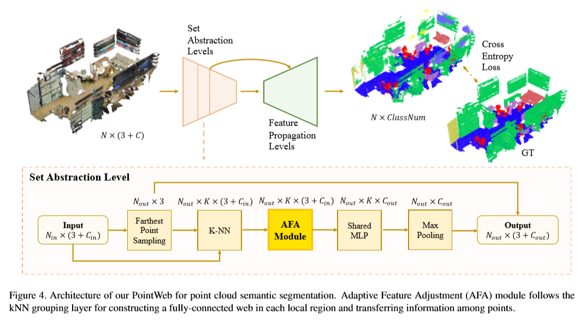

# [PointWeb: Enhancing Local Neighborhood Features for Point Cloud Processing](http://jiaya.me/papers/pointweb_cvpr19.pdf)

本文介绍了 PointWeb ，一种从点云中从局部邻域中 提取上下文特征的新方法。与以前的工作不同，我们 **在局部邻域中将每个点密切地连接在一起**，旨在基于局部区域特征指定每个点的特征以更好地表示该区域。 提出了一种新颖的模块，即自适应特征调整（ AFA ）模 块，用于找到点之间的相互作用。对于每个局部区域， 将具有点对 之间的元素影响的撞击图应用于特征差异图。然后，根据自适应学习的影响指标，由同一区域 中的其他特征拉动或推动每个特征。调整的特征用区 域信息很好地编码，因此有益于点云识别任务，例如 点云分割和分类。实验结果表明，我们的模型在语义分割和形状分类数据集上都优于现有技术。

# 论文动机
- 聚合局部信息，包括根与邻和邻与邻的关系

# 模型流程
## AFA 自适应特征调整

- 参考了力场效应，在局部邻居（i 的 K 近邻）中构建全连接图，根据 j 与 i 的差分学习残差

- imp 代表影响力， rel 代表关系

- a 是 element-wise 的
- 总结起来就是 △F = MLP(-diff) * diff，其中 diff = Fj - Fi if i ≠ j else Fi，有点像引力和斥力
## 前向传播

- 整体架构参考 PointNet++，但是在MLP之前增加了 AFA 模块

# 实验结果
## 语义分割

# 改进方向
- 1、
  - 
# 疑问
- 

# 参考
- 
