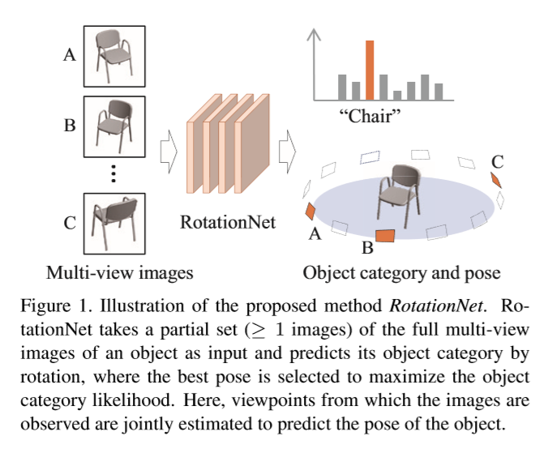
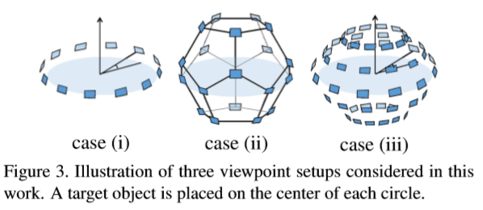
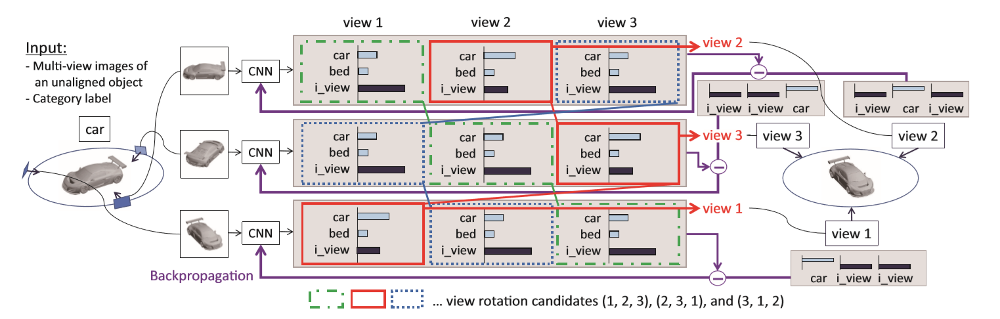
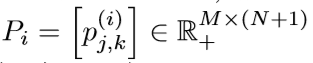
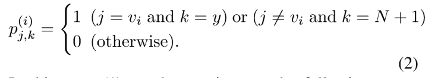
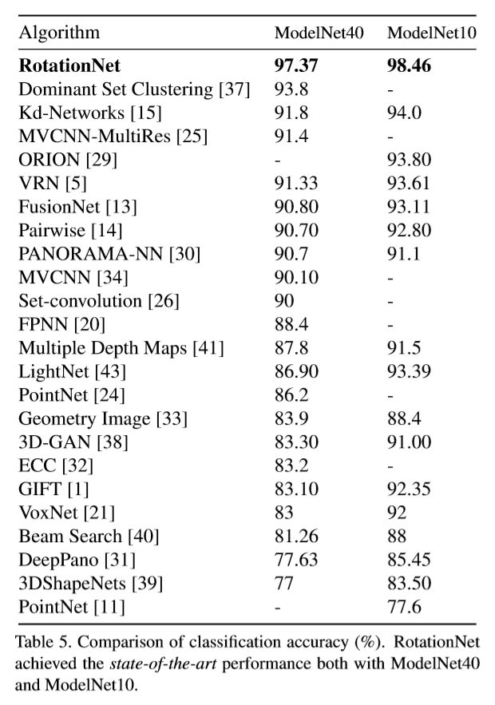

# [RotationNet: Joint Object Categorization and Pose Estimation Using Multiviews from Unsupervised Viewpoints](https://arxiv.org/abs/1603.06208)

提出了一种基于卷积神经网络 CNN 的旋转网络模型，该模型以物体的多视图图像为输入，联合估计物体的资态和类别。与之前使用已知的视点标签进行训练的方法不同，我们的方法将**视点标签**视为**潜在变量**，这些变量在使用未对齐的对象当据桌进行测练的以**非监督**的方式学习。RotationNet 使用部分多视图图像来进行推理，并且这个特性使得它在只有部分视留可用的实际杨是中非常有用。此外，我们的位姿对齐策略使我们能够获得跨类共享的特定于视留的特征表示，这对于保持对象分类和位姿估计的高精度非常重要。RotationNet的有效性是通过它在10类和40类ModelNet数据集上的优越性能来证明的。我们还表明，旋转网络，即使在没有已知姿态的情况下测练，也能在一个姿态估计数据集上获得最先进的性能。

# 论文动机
- 类间姿态对齐对于处理对象的位置和类别的联合学习很重要，因为对象分类的重要性在于当它们的外观相似时，强调不同的类别。
- RotationNet被设计为仅使用一个仅参考部分视图的模型，这个属性使得它在只有部分视图可用的实际场景中非常有用。

# 模型流程
## 视点选择策略

- 1.固定仰角位置，绕z轴旋转
- 2.以十二面体顶点作为可选视点
- 3.多个仰角，绕z轴旋转
## 训练

- 输入图片集合`[图片数，C，H，W]`，共享CNN输出不同图片对应不同视点的 softmax 预测结果`[图片数，视点数，类别数 + 1(错误视点)]`(此处图片数和视点数相等)，连乘多个图片的结果作为最终结果。
- 以 max 的选择结果作为标签`vi`，设`图片数 = 视点数 = M`，`类别数 = N`
  - 则网络最终的预测目标为： 其中`i∈M`代表`第i幅图片`，`j∈M`代表`第i幅图对应第j个视点`，`k∈N+1`代表`第i幅图片对应第j个视点时属于k的概率`
  - 
- 首先对于各种可能（这里的有三种可能123, 231, 312，因为图片之间存在先后顺序，但不知起始位置）都计算前向传播的结果，然后以最好的结果作为正确的视点，获得vi
# 实验结果

# 改进方向
- 1、引入随机位置的视点
- 2、单图依旧存在遮挡问题，直接用图网络
- 3、每次确定视点都要多次前向传播，不如直接让网络学习旋转矩阵
# 疑问
- 交叉熵

# 参考
- 
