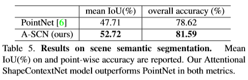

# [Attentional ShapeContextNet for Point Cloud Recognition](http://tongtianta.site/paper/17417)
我们解决点云识别问题。与先前的方法不同，点云被转换为体积/图像或者在置换不变集中独立表示，我们通过采用形状上下文的概念作为我们网络设计中的构建块来开发新的表示。最终的模型称为ShapeContextNet，由一个层次结构组成，模块不依赖于固定网格，同时仍然享有与卷积神经网络类似的属性 - 能够捕获和传播对象部分信息。此外，我们从基于自我关注的模型中获得灵感，包括一个简单而有效的上下文建模机制 - 使上下文区域选择，特征聚合和特征转换过程完全自动化。ShapeContextNet是一种端到端模型，可应用于一般点云分类和分段问题。我们在许多基准数据集上观察到竞争结果。

# 论文动机
- 局部信息

# 模型流程
## 内核

### 形状上下文

- 2D 中的形状上下文

- 局部球捕捉，同 P++
- 对于某一点，固定半径获取球域内的邻居，通过预定义的分区划分L个bin，每个bin内的点集按维度相加（sumpooling），对于每个点拥有`L * D`的特征张量，通过 MLP 转换为 `D(out)` 维向量
### 自我注意力

- 直接以整个点云作为输入
- QKV分别拥有不同的MLP
- 注意力加权后的每个点通过门控卷积升维 
## 前向传播

# 实验结果
## MNIST

- local代表只有一层，正常是5层，作者称这是为了显示层级模型的重要性
## ModelNet40

- 根据经验，r箱的数量对测试精度的影响最小，而θ箱的数量似乎对性能至关重要

## ShapeNet

## S3DIS语义分割

# 改进方向
- 1、
  - 
# 疑问
- 

# 参考
- [CSDN 门控CNN](https://blog.csdn.net/liuchonge/article/details/70238350)
